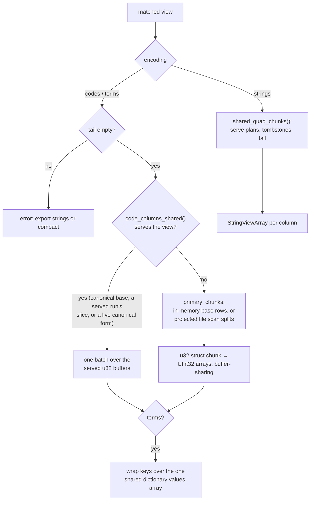

# The Arrow interface

This document describes how a store hands its data to Apache Arrow
consumers: what an exported record batch looks like, how each cell encoding
is produced from the store's own columns, what is and is not copied along
the way, and how the two bindings surface it — the Python PyCapsule
protocol and the JavaScript zero-copy views. How the rows themselves are resolved
is [matching.md](matching.md); where the term dictionary comes from is
[file-format.md](file-format.md); how appended rows (the tail) and deletes
enter a view is [mutations.md](mutations.md).

---

## 1. Purpose

A matched view is a row selection over columns that are already columnar:
`u32` term codes under the Dictionary layout, N-Triples strings under the
Default layout. The pattern-read APIs (`get_quads`, `match`, `getQuads`)
turn those columns into per-row, per-term objects, and that conversion —
not the match — is what dominates a query that keeps thousands of rows.

The Arrow interface skips it. A view is exported as Arrow record batches
whose columns share the store's buffers wherever the memory layout already
matches, so any Arrow-native engine — pyarrow, polars, DuckDB, DataFusion,
`apache-arrow` in JavaScript — consumes the match directly. For a SPARQL
engine that is the difference between joining Python tuples and joining
`uint32` columns: the codes of a Dictionary-layout store are lexicographic
ranks over one global term dictionary, so joins, filters, `DISTINCT` and
`GROUP BY` run in code space and only the surviving codes are decoded, once
each, through the dictionary. The interface is therefore also the contract
a query engine integration builds on: the schema, the projected batch
stream, the dictionary as an Arrow array, and the code bounds that turn a
term prefix into a code range.

Nothing here changes the store or its file format; the Arrow surface reads
the same views every other read path reads.

---

## 2. What is exported

### 2.1 The quad schema

Every batch carries the schema
[`quad_schema`](../core/src/store/arrow/mod.rs#L162) gives for the store's
layout and the requested [`TermEncoding`](../core/src/store/arrow/mod.rs#L49):
the four primary columns `s`, `p`, `o`, `g`, in the serialized order
([`PRIMARY_COLUMNS`](../core/src/store/schema.rs#L28)), all non-nullable,
every cell typed alike.

| Encoding | Cell type | Layouts | What a cell is |
|---|---|---|---|
| `codes` | `uint32` | Dictionary | the term's code: its rank in the sorted term dictionary |
| `terms` | `dictionary<uint32, string_view>` | Dictionary | the same code, as a key into the whole term dictionary attached as the Arrow dictionary values |
| `strings` | `string_view` | Dictionary, Default | the term's N-Triples spelling (`<iri>`, `_:blank`, `"lit"@lang`, `"lit"^^<dt>`) |

The default graph is spelled as the empty string, the store's own
convention. The TypedObject layout has no Arrow export; the dictionary
column encodings on a Default-layout store, or any encoding on a
TypedObject store, are rejected when the schema is asked for.

The schema metadata names the producer
([`META_LAYOUT`](../core/src/store/arrow/mod.rs#L35) and its siblings):
`vortex_rdf.layout` (the canonical kebab-case layout name),
`vortex_rdf.term_encoding` (`codes` | `terms` | `strings`),
`vortex_rdf.version` (the crate version) and `vortex_rdf.default_graph`
(`""`).

A **projection** — a list of [`QuadColumn`](../core/src/store/arrow/mod.rs#L98)s
— restricts and orders the columns ([`projected_schema`](../core/src/store/arrow/mod.rs#L204)
keeps the metadata); it must be non-empty and name each column once. A
triple pattern rarely needs all four positions, and a file scan reads only
the projected columns ([§3.2](#32-code-batches)).

### 2.2 The batch stream

[`to_record_batches`](../core/src/store/arrow/batches.rs#L60) is the one entry
point: it takes an encoding and an optional projection and returns a
[`QuadBatches`](../core/src/store/arrow/mod.rs#L236) — a `Stream` of
`RecordBatch`es that all carry the schema `QuadBatches::schema()` reports,
one batch per decode chunk (the whole in-memory base, or each scan split
of a file), empty chunks skipped. The stream owns everything it reads —
decoded rows, or a scan over the file handle — so it outlives the store
handle it was taken from, which is what lets a binding hand it to a
consumer that pulls batches later. Tombstoned rows are never exported.

Codes and terms need every row to be addressable in the dictionary a
consumer will decode against. A view with a non-empty append tail is not:
tail rows store their terms as strings, and the terms appended have no code
in the frozen dictionary ([mutations.md §2](mutations.md#2-additions-the-append-tail)).
Such a view rejects `codes` and `terms` with an error — export `strings`,
or compact first — exactly the gate
[`code_read_snapshot`](../core/src/store/mod.rs#L528) applies to the
code-column readers.

### 2.3 The dictionary as an Arrow array

[`DictSnapshot::to_arrow`](../core/src/store/layouts/dictionary/term_dict.rs#L1075)
returns the whole term dictionary as one `string_view` array whose element
`i` is the term of code `i`: a code → term lookup table, and the values
array every `terms` batch is keyed over. For a canonical dictionary — every
built one, and an adopted one opened in the plaintext form — it is the
dictionary's own buffers, converted on every call with nothing cached
([`arrow_values`](../core/src/store/layouts/dictionary/term_dict.rs#L682));
an as-written adopted dictionary decompresses its FSST chunks once per set
of concurrent holders and holds the result weakly, a cost bounded by the
dictionary's size, never by a result's ([§3.4](#34-the-dictionary-values)).

Two bounds expose the lexicographic-rank structure of the code space to a
planner. [`lower_bound`](../core/src/store/layouts/dictionary/term_dict.rs#L1083)
is the first code whose term is byte-wise `>=` a string, so
`lower_bound(a)..lower_bound(b)` is exactly the codes of the terms in
`a..b`; [`prefix_range`](../core/src/store/layouts/dictionary/term_dict.rs#L1092)
is the half-open code range of the terms spelled with a prefix — an IRI
namespace is the prefix `<http://…/`, and because N-Triples kinds partition
the space by first byte (`"` literals, `<` IRIs, `_` blank nodes), kind
bounds are prefix ranges too. Both are a binary search through the
dictionary cursor
([`lower_bound_bytes`](../core/src/store/layouts/dictionary/term_dict.rs#L660)),
the same probe the exact `encode` runs.

---

## 3. How a batch is produced



### 3.1 Two pipelines

The two code-typed encodings and the string encoding take different
routes, because their inputs are different things.

`codes` and `terms` ([`code_batches`](../core/src/store/arrow/batches.rs#L92))
want the primary columns exactly as the Dictionary layout stores them:
`u32` code columns. Nothing is decoded; the work is finding the right rows
and converting each column's buffer.

`strings` ([`string_batches`](../core/src/store/arrow/batches.rs#L130)) wants
N-Triples spellings, which under the Dictionary layout means resolving
codes through the dictionary and under the Default layout means the stored
strings themselves. Rather than a third decode path, it rides the store's
existing shared-term decode stream,
[`shared_quad_chunks`](../core/src/store/read/streaming.rs#L65) — the same
[`decoded_chunks`](../core/src/store/read/streaming.rs#L92) pipeline behind
`quads_vec`, which already applies serve plans, drops tombstones, decodes
each distinct term of a chunk once and appends the tail — and builds a
`string_view` column per projected position from each decoded chunk
([`shared_chunk_to_batch`](../core/src/store/arrow/batches.rs#L282)). That is a
copy of every cell's bytes, the price of materializing strings at all.

### 3.2 Code batches

Two sources feed the code pipeline, chosen per view.

**Served buffers.** When
[`code_columns_shared`](../core/src/store/read/rows.rs#L247) serves the view —
a built base's canonical `u32` columns, a served match reading the answering
index's own columns, or an adopted base's live canonical form — the batch is
built straight from the projected buffers it returns
([`code_buffers_to_batch`](../core/src/store/arrow/batches.rs#L225)), and only
those: a projection decodes nothing it leaves out. This is the path the
bindings' `match_arrow` / `matchArrow` take — their one engine-facing read —
so every consumer of a view hands out the same memory. A store *adopted* from
bytes or a file keeps its base wire-encoded unless adopted with
`codes='canonical'` — the bindings' default, which holds the columns as a
built base does ([memory.md §1](memory.md#1-the-three-forms)); as written, a
contiguous wide read decodes each column once into a form every holder
shares and the last holder frees, so two exports alive at the same time
are the same buffers ([memory.md](memory.md)); a point-sized or scattered
selection over an as-written base is gathered instead, one allocation per
call.

A *served* match — a predicate- or object-bound pattern a by-copy index
answered — is a contiguous run of that index's own columns, which hold every
quad in the family's order. A point-sized run (up to 256 rows) is read code
by code through the component's cached probes; a wider one is a slice of
the component's canonical form
([`InMemoryServePlan::code_columns`](../core/src/store/indexes/serve.rs#L391)).
Components are held compressed ([memory.md §1](memory.md#1-the-three-forms)),
so that form is the component's live canonical cache: each column decoded
once, shared by every holder alive, freed with the last — filled when the
run covers at least 1/32 of the component or a holder already keeps the
column alive, a narrower cold run decoding only itself. Rows come out in
the index's order, not the base's. On a file the same match reads the index
child through the plan's scan — a point read of a small located run, a
range scan of a wide one — and never materializes the match's row ids. A
`keep` on the base's `s` column, or on a served run's next key, narrows the
selection to a sub-range, so the export stays a slice
([matching.md §16.3](matching.md#163-keeps)).

**Primary chunks.** Otherwise
[`primary_chunks`](../core/src/store/arrow/batches.rs#L145) streams the base's
primary columns as encoded chunks in base row order, the view's selection
applied and tombstones excluded: one chunk for an in-memory base (the
array itself when the view covers all of it), and for a file one chunk per
scan split of the restricted scan every unserved file read starts from —
here in its projected form,
[`restricted_file_scan_projected`](../core/src/store/read/rows.rs#L431), so
only the projected columns are decoded off the file. A served match's
pending selection materializes first, as it does for every base-order
read. Each chunk's columns then convert through vortex-arrow's
buffer-sharing primitive kernel
([`code_chunk_to_batch`](../core/src/store/arrow/batches.rs#L246)): the Arrow
`UInt32Array` wraps the chunk's own buffer.

For `terms`, each column's keys are wrapped over the dictionary's values
array ([§3.4](#34-the-dictionary-values)); the wrap validates that every
key is in range, a linear pass over the codes and no copy.

### 3.3 What is and is not copied

| Step | Copies | Notes |
|---|---|---|
| served `u32` buffers → `UInt32Array` | no | Arrow's buffer refcounts the vortex buffer |
| adopted base, contiguous wide read | once per set of concurrent holders | the live canonical form: shared with every export alive, freed with the last ([memory.md](memory.md)) |
| served run of a by-copy index, wider than a point read | once per set of concurrent holders, or once for the run | the component's live canonical form, sliced; a cold run under 1/32 of the component decodes itself instead |
| file scan chunk → `UInt32Array` | no, after the scan's own decode | the scan materializes each split once |
| `terms` key wrap | no | one shared values `Arc` per stream |
| dictionary values, canonical dictionary (every built one, an adopted one in the plaintext form) | no | `string_view` over the dictionary's own buffers, nothing cached |
| dictionary values, FSST chunks (adopted as written) | once per set of concurrent holders | decompressed on first use, held weakly, freed with the last holder |
| `strings` cells | yes, every cell | the string materialization itself |
| Python capsule export | no | the C Data Interface hands out the same buffers |
| JavaScript view (`matchArrow` on a runtime with resizable wasm buffers) | no | the Arrow JS `Table` reads the module's memory in place; the `ArrowFFI` handle keeps it alive until `free()` |
| JavaScript parse-time copy (every other runtime) | once, the whole result | `terms` copies the dictionary once per projected column |
| JavaScript `toTable()` / `toIPC()` | once, by request | a JS-owned copy to hold past `free()`, or IPC bytes to transfer to a Worker |

### 3.4 The dictionary values

[`arrow_values`](../core/src/store/layouts/dictionary/term_dict.rs#L682)
converts the term column with vortex-arrow's canonical byte-view kernel,
which shares the views and data buffers. A canonical dictionary — every
built one, and an adopted one opened in the plaintext form — is converted
as it is, on every call, with nothing cached: the Arrow array is the
dictionary's own memory. An FSST dictionary (adopted as written) is first
executed to canonical through the Vortex session (its chunks concatenated
as a `ChunkedArray`), and that decoded column is held by a weak reference
on the dictionary: callers that arrive while some holder is alive share it,
and after the last holder drops the next call rebuilds it.

The conversion registry those kernels belong to, the `ArrowSession`, is
registered on the crate's one Vortex session at startup
([`vortex_arrow::initialize`](../core/src/session.rs#L39)).

---

## 4. Python: the PyCapsule interface

The bindings speak the
[Arrow PyCapsule interface](https://arrow.apache.org/docs/format/CDataInterface/PyCapsuleInterface.html):
objects expose `__arrow_c_array__`, `__arrow_c_schema__` or
`__arrow_c_stream__`, each returning a capsule around a C Data Interface
struct, and any consumer — `pyarrow.array`, `pyarrow.RecordBatchReader.from_stream`,
`polars.Series`/`polars.DataFrame`, a DuckDB query — imports it. Neither
side needs pyarrow; the package keeps zero runtime dependencies.

```python
stream = store.match_arrow(p="<http://xmlns.com/foaf/0.1/name>")     # ArrowQuadStream
pa.schema(stream)                                                     # s, p, o, g: uint32
table = pa.RecordBatchReader.from_stream(stream).read_all()
frame = pl.DataFrame(store.match_arrow(encoding="terms", projection=["s", "o"]))
pa.array(store.term_dict().filter_codes("is_iri", "")[0])             # a code set, zero-copy
pa.array(store.term_dict())                                           # the dictionary
```

[`match_arrow`](../python/src/store.rs#L528) resolves the pattern and
builds the core batch stream off the GIL, then wraps it in an
[`ArrowQuadStream`](../python/src/arrow.rs#L117). Its
[`__arrow_c_schema__`](../python/src/arrow.rs#L143) can be read any number
of times; [`__arrow_c_stream__`](../python/src/arrow.rs#L153) takes the
stream out of the object once (a second call raises `ValueError`) and
exports it as an `FFI_ArrowArrayStream` over a
[`BlockingReader`](../python/src/arrow.rs#L91): each `get_next` the
consumer issues blocks on the next batch on the bindings' tokio runtime.
The reader holds no Python state, so it runs wherever the consumer calls it
from — pyarrow, for one, releases the GIL around `read_next_batch` — and
batches are produced as they are pulled, never ahead of the consumer.

A code set's [`__arrow_c_array__`](../python/src/codes.rs#L205) wraps
the column's `u32` buffer as a `UInt32Array` — the same memory the buffer
protocol exposes — and the dictionary's
[`__arrow_c_array__`](../python/src/codes.rs#L205) hands out the cached
values array of [§2.3](#23-the-dictionary-as-an-arrow-array). Both go
through [`array_capsules`](../python/src/arrow.rs#L78): the array's
`ArrayData` is exported with arrow-rs's `to_ffi`, which shares the buffers
and keeps them alive from the struct's private data until `release`.

Capsule ownership follows the protocol. Each struct is boxed and its
address becomes the capsule pointer ([`capsule`](../python/src/arrow.rs#L56));
the capsule's destructor ([`release_capsule`](../python/src/arrow.rs#L41))
drops the box, which runs the struct's `release` callback — unless a
consumer already moved the struct out and nulled `release`, in which case
the drop is a no-op and the consumer owns the buffers. Release callbacks
only drop Rust reference counts, so they are safe on whatever thread
finalizes the capsule. `requested_schema` is accepted everywhere for
protocol conformance and not applied: the batches keep the schema the
stream reports.

The `pyarrow`/`polars` packages appear only as test dependencies
([tests/test_arrow.py](../python/tests/test_arrow.py)).

---

## 5. JavaScript: zero-copy views over wasm memory

JavaScript has no capsule protocol, but the C Data Interface itself needs
nothing more than memory both sides can address — and wasm linear memory
is exactly that. [`matchArrowFFI`](../js/src/store.rs#L365) resolves the
pattern, applies the `keep` constraints and the row window, drives the
core batch stream to completion (no wasm read path performs I/O, so the
stream is already resolved and nothing suspends) and exports the result as
C Data Interface structs ([`ArrowFFI::export`](../js/src/store.rs#L542)):
the `ArrowSchema` of the batches, a struct field carrying the quad schema's
metadata, and one `ArrowArray` — a struct array — per batch. The returned
`ArrowFFI` handle owns them and reports their addresses (`schemaPtr()`,
`arrayPtrs()`); dropping it runs the release callbacks, which is what frees
the exported buffers. `@vortex-rdf/arrow-js-ffi` (a fork of `arrow-js-ffi`
that also parses the `Utf8View`/`BinaryView` layout, so `string_view`
columns and dictionary values cross as they are) reads them into an Arrow
JS `Table`, either as views over the module's memory or as a copy.

The `/arrow` entry of the package packages that call with its lifetime:
importing `@vortex-rdf/vortex-rdf-store/arrow` installs
[`matchArrow`](../js/entry/match-view.js#L101) on the store class and
exports the [`MatchView`](../js/entry/match-view.js#L39) it returns. The
main entry never references `@vortex-rdf/arrow-js-ffi` or `apache-arrow`
(both optional peer dependencies), so a consumer that does not import the
subpath needs neither installed.

```javascript
import { VortexRdfStore } from '@vortex-rdf/vortex-rdf-store/arrow';

using view = store.matchArrow(null, myPredicate, null, null);
view.table.getChild('s');                                   // an Arrow JS Vector of uint32 codes
const terms = store.matchArrow(null, null, null, null, { encoding: 'terms' });
const kept = terms.toTable();                               // a JS-owned copy, to hold past free()
terms.free();
```

**Views and memory growth.** A typed array over `WebAssembly.Memory.buffer`
is a view into the module's memory, and that buffer is detached the moment
the memory grows: every such view then reads as empty, silently. A
resizable buffer removes the hazard —
`WebAssembly.Memory.prototype.toResizableBuffer()` (Chrome 144, Firefox 145,
Safari 26.2; Node 24.5+ behind `--experimental-wasm-rab-integration`) makes
growth happen in place, the buffer keeps its identity and fixed-length views
created before a `grow` stay valid. It requires the module to declare a
memory maximum, which the build sets to the wasm32 ceiling
([`.cargo/config.toml`](../.cargo/config.toml): 4 GiB, a reservation of
address space, not an allocation). The entry calls it once at load
([`enableZeroCopy`](../js/entry/match-view.js#L20)); where the call is
missing or throws, every parse copies instead and `view.zeroCopy` is
`false` — the same API, one copy at parse time.

**Lifetime.** Under zero-copy the `ArrowFFI` handle keeps the exported
buffers alive until the view's `free()` (also `Symbol.dispose`, so a `using`
declaration frees at scope exit); a vector or typed array read after that
reads recycled memory, so hold nothing past `free()`, or take
[`toTable()`](../js/entry/match-view.js#L68) — a deep copy the parse makes
out of wasm memory — first. The copy is also what `structuredClone` and a
Worker transfer accept: a wasm memory buffer is not transferable. Under the
fallback the wasm side is freed as soon as the parse has copied, and
`free()` only drops the table. A forgotten handle is reclaimed by
wasm-bindgen's `FinalizationRegistry` when its wrapper is collected.

**Worker topology.** Views exist only in the thread that hosts the module.
For a store hosted in a Web Worker, [`toIPC()`](../js/entry/match-view.js#L80)
serializes the table (apache-arrow's `tableToIPC`, on the JS side) into
Arrow IPC stream bytes — `postMessage(bytes, [bytes.buffer])`, then
`tableFromIPC` on the other side parses them without another copy. Under
`terms` each column carries its own dictionary batch. Freeing the previous
view before running the next query is the discipline a long-lived worker
keeps.

**Pushdown.** The options object
([`parse_arrow_options`](../js/src/options.rs#L157)) carries core's
`encoding` and `projection` vocabulary, parsed by core's own `FromStr` impls
so an error message reads the same from every frontend, plus the narrowing
Python's `match_arrow` takes: `keep` (per column, a `Uint32Array` or array
of codes as a code set, `{lo, hi}` as a half-open code range —
[`parse_keep`](../js/src/options.rs#L192)) applied through core's
[`keep`](../core/src/store/query/pushdown.rs#L185), then `offset`/`limit` through
[`window`](../core/src/store/query/pushdown.rs#L71), before any row is gathered.
`TermDict.decodeMany` ([`decode_many`](../js/src/store.rs#L120)) decodes a
code column back in one crossing.

**Why not an FSST-aware export.** The dictionary's values reach JS as one
`string_view` array over the dictionary's own buffers because a built
dictionary is canonical and an adopted one is decoded once at `fromBytes`
(the plaintext form, [memory.md §1.1](memory.md#11-measured)).
The alternative — handing the FSST chunks across as they are — has no
Arrow representation: vortex-arrow converts FSST only by canonicalizing,
arrow-rs's canonical extension types cover nothing like it, and an
extension type would cross the C Data Interface as field metadata that
Arrow JS 21.2 does not interpret, readable by this package alone and never
by DuckDB-WASM, Arquero or Perspective. A JS FSST decoder would serve only
the as-written form through the package's own lazy dictionary, at no gain
over the wasm bulk decode. So FSST stays a wire and as-written resident
encoding, and the Arrow surface hands out plaintext views.

---

## 6. Where it is measured

| Surface | Cells |
|---|---|
| Rust internals | [benchmark.rs](../core/benches/benchmark.rs): `arrow_{strings,codes}_dict_{mem,file}` per pattern — the `match_warm_dict_noindex_*` matrix cell beside each is the quad-API baseline for the same view; `terms_export`, `dict_built_terms_export` and `dict_adopt_terms_export` price the whole-store `terms` export per dictionary form |
| JavaScript | [compare.worker.ts](../js/bench/compare.worker.ts)'s `arrow` role: `<slug>::<pattern>::arrow` and `::arrow_codes` against the `<slug>::<pattern>` quad cell, in a process of its own under the resizable-buffer flag; [arrow.bench.ts](../js/bench/arrow.bench.ts) prices the surface per consumer step (view, `toTable()`, `toIPC()`, the reads on top); [codspeed.bench.ts](../js/bench/codspeed.bench.ts) carries `readpath::matchArrow` |
| Python | [worker.py](../python/bench/worker.py)'s `arrow` role: the same two ids against the `get_quads` cell, in a process of its own so pyarrow's footprint stays out of the memory panel; [test_codspeed.py](../python/bench/test_codspeed.py) carries `match_arrow` |

All three reach the [dashboard](https://vortex-rdf.github.io/vortex-rdf/)'s
"Data access — quads or Arrow" panel, one per tab.

---

## 7. Test map

| Surface | Tests |
|---|---|
| core | [tests/arrow.rs](../core/src/tests/arrow.rs): buffer sharing on a built store, codes/terms/strings against the code and shared-quad readers (in memory and file-backed), tail and tombstone equivalence, projection, rejected combinations; [arrow/mod.rs](../core/src/store/arrow/mod.rs) schema tests; [term_dict.rs](../core/src/store/layouts/dictionary/term_dict.rs) dictionary values and bounds |
| Python | [tests/test_arrow.py](../python/tests/test_arrow.py): capsule round-trips into pyarrow and polars, buffer-address equality for code sets, stream-versus-`get_quads` equality on file-backed and in-memory stores, one shared dictionary across columns and batches, consume-once semantics, projection, per-layout rejection; [tests/test_primitives.py](../python/tests/test_primitives.py): `keep`, windows and batches through the stream, Arrow arrays as code sets |
| JavaScript | [test/arrow.test.ts](../js/test/arrow.test.ts): `matchArrow` tables against `getQuads` and `termDict`, schema metadata, string-view and dictionary column types, projection, rejected options and layouts; the `MatchView` lifetime (zero-copy against the module's memory, views surviving growth, `toTable()`, `toIPC()`, `free()`, a Worker transfer); `keep`/`offset`/`limit` against the plain match; `decodeMany`. Run twice: `npm test` covers the parse-time copy, `npm run test:zero-copy` the views ([vitest.zero-copy.config.ts](../js/vitest.zero-copy.config.ts)) |
