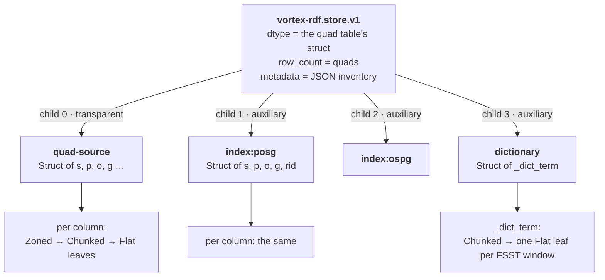

# Anatomy of a `.vortex` store file

This document describes what a vortex-rdf file *is*: the container it sits in,
the root layout that makes it a store, the quad table, the term dictionary,
the index children, and how each of those pieces maps onto the in-memory
store. How the pieces are produced is [serialization.md](serialization.md); how
they are queried is [matching.md](matching.md).

The same bytes are the bindings' exchange format: what `to_bytes` /
`toBytes()` returns is a complete store file, and `from_bytes` / `fromBytes`
and `from_file` read one grammar.

---

## 1. One picture

```text
┌──────────────────────────────────────────────────────────────┐
│ magic  "VTXF"                                                │
├──────────────────────────────────────────────────────────────┤
│ data segments                                                │
│   ┌────────────────────────────────────────────────────────┐ │
│   │ quad table (child 0, "quad-source")                    │ │
│   │   column s: chunk leaves + zone-map stats              │ │
│   │   column p: …          column o: …        column g: …  │ │
│   ├────────────────────────────────────────────────────────┤ │
│   │ index:posg   {s, p, o, g, rid}   sorted (p, o, s, g)   │ │  only if built with
│   │ index:ospg   {s, p, o, g, rid}   sorted (o, s, p, g)   │ │  secondary-by-copy
│   ├────────────────────────────────────────────────────────┤ │
│   │ index:ref-o  {val, rid}          sorted by val         │ │  only if built with
│   │ index:ref-p  {val, rid}          sorted by val         │ │  secondary-by-reference
│   ├────────────────────────────────────────────────────────┤ │
│   │ dictionary   {_dict_term}  one FSST window per leaf    │ │  Dictionary layout only
│   └────────────────────────────────────────────────────────┘ │
├──────────────────────────────────────────────────────────────┤
│ DType flatbuffer         the quad table's struct schema      │
├──────────────────────────────────────────────────────────────┤
│ Layout flatbuffer        root "vortex-rdf.store.v1"          │
│                            metadata: JSON inventory          │
│                            child 0  = quad-source (transp.)  │
│                            child 1… = the components above   │
├──────────────────────────────────────────────────────────────┤
│ Statistics flatbuffer    file-level per-column stats         │
├──────────────────────────────────────────────────────────────┤
│ Footer flatbuffer        segment map: offset + length of     │
│                          every segment, by id                │
├──────────────────────────────────────────────────────────────┤
│ Postscript + 8-byte EOF  locators of the four blocks above,  │
│                          format version, magic "VTXF"        │
└──────────────────────────────────────────────────────────────┘
```

A reader opens the file by reading its tail once, parses the postscript and
footer, and from then on fetches only the segments a read touches — a zone-map
table, a chunk leaf, a dictionary window. Nothing about the byte framing is
specific to this crate: it is a [Vortex file](https://docs.vortex.dev/specs/file-format)
whose root layout happens to be ours.

---

## 2. It is a Vortex file

A Vortex file stores a tree of **layouts** — the writer's description of how
an array is cut up — plus the **segments** those layouts reference, and enough
footer metadata to rebuild the tree ([vortex-file docs](https://docs.rs/vortex-file)).
The layouts this store's files contain:

| Layout | Role here |
|---|---|
| `vortex-rdf.store.v1` | the root: this crate's own layout ([§3](#3-the-store-root-vortex-rdfstorev1)) |
| Struct | one child per column of a table — the quad table, an index child, the dictionary |
| Zoned | a column wrapped with a table of per-block statistics, for filter pruning |
| Dict | a column dictionary-encoded by the writer: a values child and a codes child |
| Chunked | a column cut into row ranges, each a child at a known row offset |
| Flat | a leaf: one serialized array in one segment |

The footer's **segment map** records every segment's offset and length by id;
a layout names its segments by id, so any subtree's on-disk size is a sum over
the map with no I/O ([`subtree_bytes`](../core/src/io/container/layout.rs#L183)).
The file's dtype is embedded, so the file is self-describing.

---

## 3. The store root: `vortex-rdf.store.v1`

The root layout is registered in the crate's Vortex session on every target
([`register`](../core/src/io/container/layout.rs#L131)); its stable
id is [`STORE_LAYOUT_ID`](../core/src/io/container/mod.rs#L38). A file whose
root has any other id is refused as "not a vortex-rdf store file".



Two kinds of child:

- **Child 0 is transparent** ([`QUAD_SOURCE_NAME`](../core/src/io/container/mod.rs#L41)):
  the root delegates its dtype, row count and scan to it. A plain Vortex reader
  with the layout registered scans the file exactly like a quad table and never
  sees the components in its columns.
- **Every further child is auxiliary**, addressed by the name its descriptor
  carries. Each has its own row space and its own schema. In files this crate
  writes the index children come first, the dictionary last.

### 3.1 The inventory

The root's metadata is a JSON document ([`WireMetadata`](../core/src/io/container/wire.rs#L177))
carried inside the Layout flatbuffer, so it is read with the footer:

```json
{
  "version": 1,
  "quads_sorted": true,
  "components": [
    { "name": "index:posg", "role": "index",
      "implementation": "secondary-by-copy/posg", "version": 1,
      "required": false, "sorted": true,
      "fields": [ { "name": "s", "kind": "u32" }, { "name": "p", "kind": "u32" },
                  { "name": "o", "kind": "u32" }, { "name": "g", "kind": "u32" },
                  { "name": "rid", "kind": "u32" } ] },
    { "name": "dictionary", "role": "dictionary",
      "implementation": "sorted-terms-fsst-v1", "version": 1,
      "required": true, "sorted": true,
      "fields": [ { "name": "_dict_term", "kind": "utf8" } ] }
  ]
}
```

| Field | Meaning |
|---|---|
| `version` | the metadata grammar; readers reject any value but `1` |
| `quads_sorted` | the writer's provenance that the quad rows are in **global `(s, p, o, g)` order** — the only thing a reader may restore the subject `IsSorted` stamp from, since Vortex statistics do not record sortedness |
| `components[i]` | describes child `i + 1` ([`StoreComponentDescriptor`](../core/src/io/container/wire.rs#L107)) |
| `name` | the child's identity; non-empty, unique, never `quad-source` |
| `role` | `dictionary`, `index`, `change-set` (reserved for future delta components) or `other` |
| `implementation` | the slug a reader interprets the columns through — the key of the [known-component registry](../core/src/store/indexes/components.rs#L62) |
| `version` | the implementation's version, positive |
| `required` | a reader that cannot interpret a required component **must fail the open**; an unknown optional component is skipped |
| `sorted` | the writer's provenance that the sort-key columns are *globally* sorted — a reader may binary-search the child only when this is set; absent means false |
| `fields` | the column shape in a closed vocabulary of non-nullable kinds: `u32`, `u64`, `utf8` |

On open the layout checks that the child count is `1 + components.len()`,
that child 0 has the root's row count, and that every component child's dtype
matches its descriptor ([`deserialize`](../core/src/io/container/layout.rs#L49));
[`classify_component`](../core/src/store/open.rs#L47) then turns each
descriptor into the dictionary, a known index, or a skip.

---

## 4. The quad table

Child 0 is a struct of primary columns whose shape is decided by the layout
the store was built with ([serialization.md §7](serialization.md#7-columns-per-layout)).
A reader detects the layout from the dtype alone: a `u32` subject column means
`Dictionary`, an `o_kind` field means `TypedObject`, otherwise `Default`.

| Layout | Columns | Each term is… |
|---|---|---|
| `Default` | `s`, `p`, `o`, `g` — non-nullable `Utf8` | its N-Triples spelling: `<iri>`, `_:id`, `"lit"`, `"lit"@lang`, `"lit"^^<dt>`; `g` is `""` for the default graph |
| `TypedObject` | `s`, `p`, `o_kind` (`u8`), `o_value` (`Utf8`), `o_datatype` (nullable `Utf8`), `o_lang` (nullable `Utf8`), `g` | as `Default`, with the object split: kind 0 IRI, 1 blank node, 2 plain literal, 3 language-tagged, 4 typed |
| `Dictionary` | `s`, `p`, `o`, `g` — non-nullable `u32` | a code: the term's position in the sorted `dictionary` child |

**Row order.** Every writer of this crate emits the rows in `(s, p, o, g)`
order — string order under the string layouts, code order under `Dictionary`,
which is the same order because codes are lexicographic ranks — and records
`quads_sorted: true`. That order is what makes a bound prefix of a pattern one
contiguous run of rows ([matching.md §6.1](matching.md#61-prefix-probe)).

**How a column is laid out.** The quad table and the index children are
written by Vortex's default write strategy, so each column becomes:

```text
column
 └─ Zoned                 one statistics row per 8,192-row block
     ├─ stats table       min / max (strings: truncated to 64 bytes),
     │                    null count, NaN count
     └─ data
         └─ Chunked       row ranges coalesced toward ~1 MiB of data
             ├─ Flat      one compressed array = one segment
             ├─ Flat
             └─ …
```

A column the writer's sampling finds worth it is additionally
dictionary-encoded at the layout level (a `Dict` layout with a values child and
a codes child). The array inside each leaf is whatever the writer's compressor
chose for that chunk — constant, run-end, frame-of-reference and bit-packing,
dictionary, FSST for strings, … — the store pins no encoding for the quad
columns and reads whatever it finds. The file-level Statistics block
additionally carries per-column min, max, sum, null count and NaN count.

What the store reads from this structure:

- the **zone-map tables** for pruning: a pushed-down filter is evaluated
  against every block's statistics first, and the surviving blocks' envelope
  bounds the scan ([matching.md §7.2](matching.md#72-zone-map-pruning));
- the **chunk leaves** of the `u32` code columns as *chunk probes*
  ([`ColumnChunks`](../encoded-search/src/layout.rs)): a leaf's segment is
  fetched and its array rebuilt in the wire encoding — not decompressed — and
  then binary-searched or point-read in place. A column the writer
  dictionary-encoded at the layout level is probed through its codes leaves,
  each composed with the dictionary's values leaf (fetched once, shared), so
  an index child's `p` or `o` column locates its runs whichever shape the
  writer's sampling gave it. This is how a file-backed Dictionary store
  resolves a bound subject to its exact row range, and how index children
  locate a run, touching only the leaves the bisection crosses.

---

## 5. The `dictionary` child

Present under the `Dictionary` layout, and then **required**: the quad columns
are bare codes and cannot be decoded without it.

| Property | Value |
|---|---|
| `name` / `role` | `dictionary` / `dictionary` |
| `implementation` / `version` | `sorted-terms-fsst-v1` / 1 |
| `required` / `sorted` | `true` / `true` |
| schema | one column, [`_dict_term`](../core/src/store/layouts/dictionary/term_dict.rs#L43): non-nullable `Utf8` |
| contents | every distinct term of the dataset — subjects, predicates, objects, graph names and the default graph's `""` in one namespace — sorted, each once |
| codes | implicit: the term at row *i* has code *i* |
| size limit | at most `i32::MAX` terms |

The column is FSST-compressed **at the source**, in independent windows of
65,536 terms ([`DICT_CHUNK_ROWS`](../core/src/store/layouts/dictionary/term_dict.rs#L51))
that share one symbol table trained on the whole column. The child is written
through a pass-through strategy ([`dict_child_strategy`](../core/src/io/container/write.rs#L191))
rather than the default pipeline: a Struct over a Chunked layout of Flat
leaves, **one leaf per window, written verbatim** — no sampling, no
re-encoding, and no zone maps. The window boundaries are therefore visible in
the file, which is what the file-backed reader relies on.

**Residency.** At open the store compares the child's on-disk size (a footer
sum, no I/O) with a budget:

| Budget | Where |
|---|---|
| 512 MiB | [`DICT_MAX_RESIDENT_BYTES_DEFAULT`](../core/src/store/open.rs#L108) |
| any byte count | the `VORTEX_RDF_DICT_MAX_RESIDENT_BYTES` environment variable |
| per open | [`from_file_with_dict_residency`](../core/src/store/open.rs#L149) (`0` forces file-backed, `u64::MAX` forces resident); Python's `max_resident_bytes=` |

- **Resident** (within budget): one scan of the child lifts it into memory,
  keeping every window FSST-compressed. Term → code is a binary search that
  decodes one term per step (FSST is not order-preserving, so the search
  cannot run on the compressed bytes); code → term is a positional read.
- **File-backed** (over budget): the terms stay in the file.
  [`TermChunks`](../core/src/store/layouts/dictionary/file_backed.rs#L46)
  resolves the child's leaves once; a probe binary-searches by per-row reads,
  fetching only the leaves the bisection crosses, and a fetched leaf stays in
  its wire encoding for the store's lifetime. A match's four bound terms are
  probed concurrently ([matching.md §3](matching.md#3-stage-a--prepare_pattern)).
  A child whose layout shape the handle cannot address is lifted resident
  regardless.

Either way a 256-slot direct-mapped memo caches recent term → code answers,
absence included.

---

## 6. The index children

Each secondary index persists as one or two auxiliary children, all written
`required: false` (a reader that ignores them still answers every query, only
slower) and `sorted: true`.

| Child | Index | `implementation` | Columns | Row order | Answers |
|---|---|---|---|---|---|
| `index:posg` | `secondary-by-copy` | `secondary-by-copy/posg` | `s`, `p`, `o`, `g`, `rid` | `(p, o, s, g)` | bound `p`; bound `p` **and** `o` in one prefix search |
| `index:ospg` | `secondary-by-copy` | `secondary-by-copy/ospg` | `s`, `p`, `o`, `g`, `rid` | `(o, s, p, g)` | bound `o` |
| `index:ref-o` | `secondary-by-reference` | `secondary-by-reference/o` | `val`, `rid` | `val`, then `rid` | bound `o` |
| `index:ref-p` | `secondary-by-reference` | `secondary-by-reference/p` | `val`, `rid` | `val`, then `rid` | bound `p` |

Shared rules:

- **Term encoding follows the layout**: `Utf8` strings under `Default` and
  `TypedObject` (a `TypedObject` object appears as its full N-Triples term),
  `u32` codes under `Dictionary`. `rid` is always a non-nullable `u32`.
- **`rid` is the quad's row id in the quad table.** That is what lets a match
  resolved through an index compose with row selections, tombstones and
  further matches without renumbering anything ([matching.md §1](matching.md#1-what-a-match-produces)).
- **One row per quad.** A child whose row count differs from the quad table's
  fails the open ([`check_component_rows`](../core/src/store/indexes/components.rs#L75)).
- **A bound graph is never a sort key**, and neither index answers a
  bound-subject pattern — the sorted quad table is the better path there.

Both copy families keep the same column names; the child's *identity* says
which order its rows are in. Inside a lead-column run the next key is itself
sorted — that is what a `(p, o)` prefix search relies on — and the copies hold
whole quads, so a match they resolve can be *served* from the copy's own
contiguous run instead of gathering the quad table at scattered row ids
([matching.md §8.4](matching.md#84-serve-plans-side-by-side)). The
`{val, rid}` children hold no quads to serve from; their answer is always the
row ids.

On a file-backed store an index child is never lifted into memory. Under the
`Dictionary` layout its run is located by binary-searching the child's
encoded chunks through the chunk probes of [§4](#4-the-quad-table)
([`locate_component_run`](../core/src/store/indexes/row_ids.rs#L49)): a
located run of at most `POINT_GATHER_MAX_ROWS` rows is point-read, a wider
one is read as a scan of exactly that row range. A run the probes cannot
locate — a string-keyed child under the other layouts — is answered by a
pushed-down `val == probe` scan of the child
([matching.md §8](matching.md#8-the-index-resolvers)).

---

## 7. A worked example

The four quads

```turtle
@prefix ex: <http://example.org/> .
@prefix foaf: <http://xmlns.com/foaf/0.1/> .
@prefix rdf: <http://www.w3.org/1999/02/22-rdf-syntax-ns#> .

ex:alice a foaf:Person ;
   foaf:name "Alice" .

ex:bob a foaf:Person ;
   foaf:knows ex:alice .
```

sorted by `(s, p, o, g)` (`<http://www.w3.org/1999/02/22-rdf-syntax-ns#type>`
sorts before `<http://xmlns.com/…>`), are the rows:

| row | s | p | o | g |
|---|---|---|---|---|
| 0 | `ex:alice` | `rdf:type` | `foaf:Person` | `""` |
| 1 | `ex:alice` | `foaf:name` | `"Alice"` | `""` |
| 2 | `ex:bob` | `rdf:type` | `foaf:Person` | `""` |
| 3 | `ex:bob` | `foaf:knows` | `ex:alice` | `""` |

Under the `Default` layout that table *is* the quad-source child. Under the
`Dictionary` layout the `dictionary` child holds the sorted terms (`"` sorts
before `<`), and the quad-source child holds their positions:

| code | `_dict_term` |
|---|---|
| 0 | `""` |
| 1 | `"Alice"` |
| 2 | `<http://example.org/alice>` |
| 3 | `<http://example.org/bob>` |
| 4 | `<http://www.w3.org/1999/02/22-rdf-syntax-ns#type>` |
| 5 | `<http://xmlns.com/foaf/0.1/Person>` |
| 6 | `<http://xmlns.com/foaf/0.1/knows>` |
| 7 | `<http://xmlns.com/foaf/0.1/name>` |

| row | s | p | o | g |
|---|---|---|---|---|
| 0 | 2 | 4 | 5 | 0 |
| 1 | 2 | 7 | 1 | 0 |
| 2 | 3 | 4 | 5 | 0 |
| 3 | 3 | 6 | 2 | 0 |

With `secondary-by-copy`, the two copies (codes shown; strings under the other
layouts):

| `index:posg` | s | p | o | g | rid |   | `index:ospg` | s | p | o | g | rid |
|---|---|---|---|---|---|---|---|---|---|---|---|---|
| | 2 | 4 | 5 | 0 | 0 | | | 2 | 7 | 1 | 0 | 1 |
| | 3 | 4 | 5 | 0 | 2 | | | 3 | 6 | 2 | 0 | 3 |
| | 3 | 6 | 2 | 0 | 3 | | | 2 | 4 | 5 | 0 | 0 |
| | 2 | 7 | 1 | 0 | 1 | | | 3 | 4 | 5 | 0 | 2 |

With `secondary-by-reference`:

| `index:ref-o` | val | rid |   | `index:ref-p` | val | rid |
|---|---|---|---|---|---|---|
| | 1 | 1 | | | 4 | 0 |
| | 2 | 3 | | | 4 | 2 |
| | 5 | 0 | | | 6 | 3 |
| | 5 | 2 | | | 7 | 1 |

The pattern `(? ? ex:alice ?)` becomes: code of `<http://example.org/alice>`
= 2 → binary search `index:ref-o`'s `val` for 2 → position 1 → `rid` 3 → row 3.

---

## 8. Reading a file

| Step | What is read |
|---|---|
| `from_file` | the file tail: postscript, footer, dtype, layout tree with its JSON inventory. Every descriptor is classified; an unknown required one fails here. Under `Dictionary`, the residency decision runs ([§5](#5-the-dictionary-child)) — a dictionary within budget is the one thing scanned at open. Index children are not touched. |
| a query | the zone-map tables the filter needs, the chunk leaves a probe bisects, then the leaves of the rows the scan finally decodes — or, on a served match, the index child's own run |
| `size()` on a pending filter | statistics and filter masks only; no row is projected |
| `from_bytes` / `fromBytes` | everything: the quad table is scanned into memory, the subject stamp is restored from `quads_sorted`, the dictionary is lifted (still FSST), and each index child is adopted by its reader with nothing read — it is scanned and canonicalized on its first use |

The opened handle ([`NativeStoreFile`](../core/src/store/native_file.rs#L30))
keeps what repeated queries reuse: the layout reader tree (so zone-map tables
decode once), the quad table's split ranges, one reader per component,
per-column chunk-probe handles, memoized pruning envelopes, and bound filter
trees.

---

## 9. The in-memory twin

A store in memory holds the same three pieces the file does, in the forms the
read paths are written against ([`QuadsSource`](../core/src/store/source.rs#L35)):

| In the file | In memory |
|---|---|
| `quad-source` child | `base: ArrayRef` — one struct, columns in the *compressed-resident* form: each `u32` column `Constant`, `RunEnd` or bit-packed, behind a `vortex.shared` wrapper whose cache holds the decoded primitive once a bulk read needs it |
| `quads_sorted` | the `IsSorted` stamp on the `s` column |
| `index:*` children | `components: Arc<[IndexComponent]>` — the same rows under the same column names, with the descriptor's `sorted` flag; adopted from bytes they stay deferred until first use |
| `dictionary` child | `ResolvedLayout::Dictionary(DictAccess::Resident \| FileBacked)` |
| footer segment map | the residency decision, and the chunk leaves the probes fetch |
| — | `probes: StructProbes` — encoded-search probes resolved once over the base's columns, shared by every view |
| — | `selection`, `deleted`, `serve` — a view's restrictions ([matching.md §1](matching.md#1-what-a-match-produces)) |

A file-backed store (`QuadsSource::File`) holds none of the rows: the file
handle, a pushed-down filter, a row selection, tombstones and an optional serve
plan. Its index data stays in the index children and is reached by chunk
probes and pushed-down scans; a file-backed store structurally cannot carry
in-memory components.

**What is not in the file.** Appended rows live in an in-memory `Tail` (under
`Dictionary`, as `Default`-layout strings — an appended term has no code) and
deletions are tombstone masks; neither has a wire form. Writing a mutated store
folds both back in: the rows are re-sorted, the index children rebuilt and,
under `Dictionary`, the dictionary re-derived ([serialization.md §11](serialization.md#11-rebuilds-mutated-stores-compaction-export)).

---

## 10. What a file must satisfy

The contract a foreign writer has to honor for this crate's readers to answer
correctly — every one of these is something a reader trusts rather than
checks:

1. The root layout id is `vortex-rdf.store.v1`; child 0 is the quad table and
   carries the root's dtype and row count; every further child matches its
   descriptor's dtype, in inventory order.
2. The inventory is JSON with `version: 1`; component names are unique and
   never `quad-source`; field kinds are `u32`, `u64` or `utf8`, all
   non-nullable.
3. Terms are spelled in N-Triples form; the default graph is the empty string
   — in the quad columns, the dictionary and the index children alike.
4. `quads_sorted: true` only when the rows are in global `(s, p, o, g)` order
   — a true claim licenses the prefix probe on every bound role; a false one
   returns wrong matches.
5. A component's `sorted: true` only when its sort-key columns are globally
   sorted, not merely within each chunk.
6. Under `Dictionary`: a `dictionary` child with implementation
   `sorted-terms-fsst-v1` holding every code's term at its row, sorted and
   unique; `required: true`.
7. Index children hold exactly one row per quad, `rid` addressing quad-table
   rows; unknown index slugs must be `required: false`.

Anything a reader cannot interpret and that is marked `required` fails the
open rather than being read around.

---

## 11. Constants

| Constant | Value | Defined in |
|---|---|---|
| `STORE_LAYOUT_ID` | `vortex-rdf.store.v1` | [`container/mod.rs`](../core/src/io/container/mod.rs#L38) |
| `STORE_METADATA_VERSION` | 1 | [`wire.rs`](../core/src/io/container/wire.rs#L18) |
| row block / zone size | 8,192 rows | Vortex default write strategy |
| data block target | ~1 MiB | Vortex default write strategy |
| `DICT_CHUNK_ROWS` | 65,536 terms per FSST window and leaf | [`term_dict.rs`](../core/src/store/layouts/dictionary/term_dict.rs#L46) |
| `DICT_MAX_RESIDENT_BYTES_DEFAULT` | 512 MiB | [`open.rs`](../core/src/store/open.rs#L108) |
| `PROBE_CACHE_SLOTS` | 256 | [`term_dict.rs`](../core/src/store/layouts/dictionary/term_dict.rs#L432) |
| `POINT_GATHER_MAX_ROWS` | 256 rows — a located run at most this wide is point-read through the chunk probes; the file-backed dictionary point-reads a batch of at most this many codes through its chunk leaves and scans a wider one | [`selection.rs`](../core/src/store/selection.rs#L338) |
| `DEFAULT_CHUNK_ROWS` | 100,000 rows per builder chunk (a producer batch size; the writer re-blocks at 8,192) | [`builders/mod.rs`](../core/src/store/builders/mod.rs#L52) |

---

## 12. Source map

| Concern | File |
|---|---|
| Container identity, root layout vtable, component addressing | [`core/src/io/container/mod.rs`](../core/src/io/container/mod.rs), [`layout.rs`](../core/src/io/container/layout.rs) |
| Inventory descriptors and their JSON codec | [`core/src/io/container/wire.rs`](../core/src/io/container/wire.rs) |
| Write strategy, component sources | [`core/src/io/container/write.rs`](../core/src/io/container/write.rs), [`sources.rs`](../core/src/io/container/sources.rs) |
| Opening files and bytes, roster interpretation, residency | [`core/src/store/open.rs`](../core/src/store/open.rs), [`core/src/io/read.rs`](../core/src/io/read.rs) |
| The opened-file handle and its caches | [`core/src/store/native_file.rs`](../core/src/store/native_file.rs) |
| Primary column names | [`core/src/store/schema.rs`](../core/src/store/schema.rs), [`layouts/typed_object.rs`](../core/src/store/layouts/typed_object.rs) |
| Term dictionary: storage, FSST windows, residency, file-backed reads | [`core/src/store/layouts/dictionary/term_dict.rs`](../core/src/store/layouts/dictionary/term_dict.rs), [`access.rs`](../core/src/store/layouts/dictionary/access.rs), [`file_backed.rs`](../core/src/store/layouts/dictionary/file_backed.rs) |
| Index children: schemas, sort orders, registry, adoption | [`core/src/store/indexes/secondary_by_copy.rs`](../core/src/store/indexes/secondary_by_copy.rs), [`secondary_by_reference.rs`](../core/src/store/indexes/secondary_by_reference.rs), [`components.rs`](../core/src/store/indexes/components.rs) |
| Chunk probes over wire-encoded leaves | [`encoded-search/src/layout.rs`](../encoded-search/src/layout.rs), [`lib.rs`](../encoded-search/src/lib.rs) |
| Locating and point-reading index runs on file | [`core/src/store/indexes/row_ids.rs`](../core/src/store/indexes/row_ids.rs), [`scan/gather.rs`](../core/src/store/scan/gather.rs) |
| In-memory forms: compressed-resident columns, probes, view state | [`core/src/store/array.rs`](../core/src/store/array.rs), [`probes.rs`](../core/src/store/probes.rs), [`source.rs`](../core/src/store/source.rs) |
| Session: registered encodings and zone aggregates | [`core/src/session.rs`](../core/src/session.rs) |
