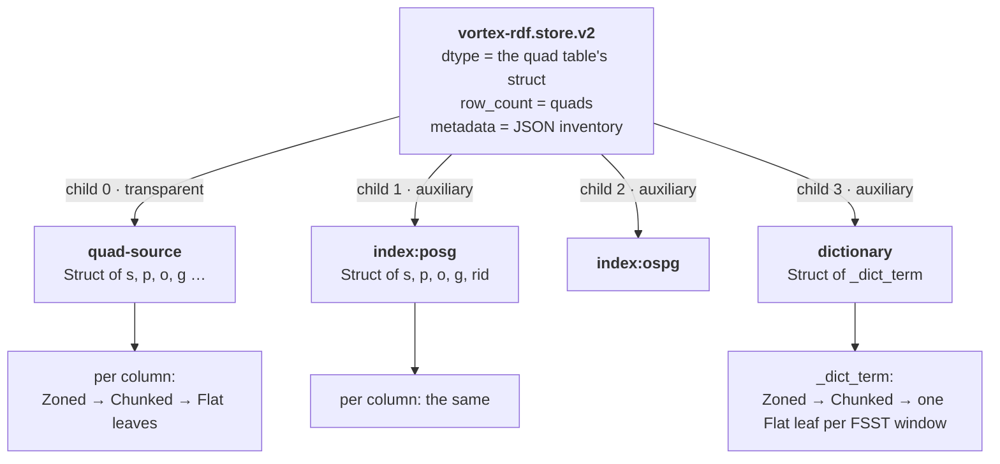

# Anatomy of a `.vortex` store file

This document describes what a vortex-rdf file *is*: the container it sits in,
the root layout that makes it a store, the quad table, the term dictionary,
the index children, and how each of those pieces maps onto the in-memory
store. How the pieces are produced is [serialization.md](serialization.md); how
they are queried is [matching.md](matching.md).

The same bytes are the bindings' exchange format: what `to_bytes` /
`toBytes()` returns is a complete store file, and `from_bytes` / `fromBytes`
and `from_file` read one grammar.

---

## 1. One picture

```text
┌──────────────────────────────────────────────────────────────┐
│ magic  "VTXF"                                                │
├──────────────────────────────────────────────────────────────┤
│ data segments                                                │
│   ┌────────────────────────────────────────────────────────┐ │
│   │ quad table (child 0, "quad-source")                    │ │
│   │   column s: chunk leaves + zone-map stats              │ │
│   │   column p: …          column o: …        column g: …  │ │
│   ├────────────────────────────────────────────────────────┤ │
│   │ index:posg   {s, p, o, g, rid}   sorted (p, o, s, g)   │ │  only if built with
│   │ index:ospg   {s, p, o, g, rid}   sorted (o, s, p, g)   │ │  secondary-by-copy
│   ├────────────────────────────────────────────────────────┤ │
│   │ index:ref-o  {val, rid}          sorted by val         │ │  only if built with
│   │ index:ref-p  {val, rid}          sorted by val         │ │  secondary-by-reference
│   ├────────────────────────────────────────────────────────┤ │
│   │ dictionary   {_dict_term}  one FSST window per leaf    │ │  Dictionary layout only
│   └────────────────────────────────────────────────────────┘ │
├──────────────────────────────────────────────────────────────┤
│ DType flatbuffer         the quad table's struct schema      │
├──────────────────────────────────────────────────────────────┤
│ Layout flatbuffer        root "vortex-rdf.store.v2"          │
│                            metadata: JSON inventory          │
│                            child 0  = quad-source (transp.)  │
│                            child 1… = the components above   │
├──────────────────────────────────────────────────────────────┤
│ Statistics flatbuffer    file-level per-column stats         │
├──────────────────────────────────────────────────────────────┤
│ Footer flatbuffer        segment map: offset + length of     │
│                          every segment, by id                │
├──────────────────────────────────────────────────────────────┤
│ Postscript + 8-byte EOF  locators of the four blocks above,  │
│                          format version, magic "VTXF"        │
└──────────────────────────────────────────────────────────────┘
```

A reader opens the file by reading its tail once, parses the postscript and
footer, and from then on fetches only the segments a read touches — a zone-map
table, a chunk leaf, a dictionary window. Nothing about the byte framing is
specific to this crate: it is a [Vortex file](https://docs.vortex.dev/specs/file-format)
whose root layout happens to be ours.

---

## 2. It is a Vortex file

A Vortex file stores a tree of **layouts** — the writer's description of how
an array is cut up — plus the **segments** those layouts reference, and enough
footer metadata to rebuild the tree ([vortex-file docs](https://docs.rs/vortex-file)).
The layouts this store's files contain:

| Layout | Role here |
|---|---|
| `vortex-rdf.store.v2` | the root: this crate's own layout ([§3](#3-the-store-root-vortex-rdfstorev2)) |
| Struct | one child per column of a table — the quad table, an index child, the dictionary |
| Zoned | a column wrapped with a table of per-block statistics, for filter pruning |
| Dict | a column dictionary-encoded by the writer: a values child and a codes child |
| Chunked | a column cut into row ranges, each a child at a known row offset |
| Flat | a leaf: one serialized array in one segment |

The footer's **segment map** records every segment's offset and length by id,
and a layout names its segments by id, so a read fetches exactly the segments
of the leaves it touches. The file's dtype is embedded, so the file is
self-describing.

The writer is limited to two editions ([`session.rs`](../core/src/session.rs#L50)):
Vortex's frozen `core` edition `CORE_2026_08_3` — every encoding, layout,
extension dtype and zone-map aggregate a store file may hold — and the store
edition, whose one member is the root layout. A frozen edition never changes,
so a Vortex upgrade cannot widen what a store file holds; a wire form outside
it, such as per-chunk frame-of-reference (`fastlanes.for.v2`), is never
written.

---

## 3. The store root: `vortex-rdf.store.v2`

The root layout is registered in the crate's Vortex session on every target
([`register`](../core/src/io/container/layout.rs#L200)); its stable
id is [`STORE_LAYOUT_ID`](../core/src/io/container/mod.rs#L43). A file whose
root has any other id is refused as "not a vortex-rdf store file".

The session also registers `vortex-rdf.store.v1`
([`LEGACY_STORE_LAYOUT_ID`](../core/src/io/container/mod.rs#L48)), the root of
files written by vortex-rdf 0.11 or earlier, so that such a file opens far
enough to be **refused** with an error saying to rebuild it from its RDF
source — in every open path (`from_file`, `from_bytes`, the Python constructor
and `from_bytes`, JavaScript's `fromBytes`). Readers rely on two guarantees of
the `v2` writers that nothing checks at open: each quad is stored once, and a
reference index's children are in `(val, rid)` order
([§10](#10-what-a-file-must-satisfy)). No edition admits the `v1` id, so
nothing writes it.


```mermaid
flowchart TD
    R["<b>vortex-rdf.store.v2</b><br/>dtype = the quad table's struct<br/>row_count = quads<br/>metadata = JSON inventory"]
    R -- "child 0 · transparent" --> Q["<b>quad-source</b><br/>Struct of s, p, o, g …"]
    R -- "child 1 · auxiliary" --> I1["<b>index:posg</b><br/>Struct of s, p, o, g, rid"]
    R -- "child 2 · auxiliary" --> I2["<b>index:ospg</b>"]
    R -- "child 3 · auxiliary" --> D["<b>dictionary</b><br/>Struct of _dict_term"]
    Q --> QS["per column:<br/>Zoned → Chunked → Flat leaves"]
    I1 --> IS["per column: the same"]
    D --> DS["_dict_term:<br/>Zoned → Chunked → one Flat leaf per FSST window"]
```

Two kinds of child:

- **Child 0 is transparent** ([`QUAD_SOURCE_NAME`](../core/src/io/container/mod.rs#L51)):
  the root delegates its dtype, row count and scan to it. A plain Vortex reader
  with the layout registered scans the file exactly like a quad table and never
  sees the components in its columns.
- **Every further child is auxiliary**, addressed by the name its descriptor
  carries. Each has its own row space and its own schema. In files this crate
  writes the index children come first, the dictionary last.

### 3.1 The inventory

The root's metadata is a JSON document ([`WireMetadata`](../core/src/io/container/wire.rs#L177))
carried inside the Layout flatbuffer, so it is read with the footer:

```json
{
  "version": 1,
  "quads_sorted": true,
  "components": [
    { "name": "index:posg", "role": "index",
      "implementation": "secondary-by-copy/posg", "version": 1,
      "required": false, "sorted": true,
      "fields": [ { "name": "s", "kind": "u64" }, { "name": "p", "kind": "u64" },
                  { "name": "o", "kind": "u64" }, { "name": "g", "kind": "u64" },
                  { "name": "rid", "kind": "u64" } ] },
    { "name": "dictionary", "role": "dictionary",
      "implementation": "sorted-terms-fsst-v1", "version": 2,
      "required": true, "sorted": true,
      "fields": [ { "name": "_dict_term", "kind": "utf8" } ] }
  ]
}
```

| Field | Meaning |
|---|---|
| `version` | the metadata grammar; readers reject any value but `1` |
| `quads_sorted` | the writer's provenance that the quad rows are in **global `(s, p, o, g)` order** — the only thing a reader may restore the subject `IsSorted` stamp from, since Vortex statistics do not record sortedness |
| `components[i]` | describes child `i + 1` ([`StoreComponentDescriptor`](../core/src/io/container/wire.rs#L107)) |
| `name` | the child's identity; non-empty, unique, never `quad-source` |
| `role` | `dictionary`, `index`, `change-set` (reserved for future delta components) or `other` |
| `implementation` | the slug a reader interprets the columns through — the key of the [known-component registry](../core/src/store/indexes/components.rs#L64) |
| `version` | the implementation's version, positive |
| `required` | a reader that cannot interpret a required component **must fail the open**; an unknown optional component is skipped |
| `sorted` | the writer's provenance that the sort-key columns are *globally* sorted — a reader may binary-search the child only when this is set; absent means false |
| `fields` | the column shape in a closed vocabulary of non-nullable kinds: `u32`, `u64`, `utf8` |

On open the layout checks that the child count is `1 + components.len()`,
that child 0 has the root's row count, and that every component child's dtype
matches its descriptor ([`deserialize`](../core/src/io/container/layout.rs#L49));
[`classify_component`](../core/src/store/open.rs#L84) then turns each
descriptor into the dictionary, a known index, or a skip.

---

## 4. The quad table

Child 0 is a struct of primary columns whose shape is decided by the layout
the store was built with ([serialization.md §7](serialization.md#7-columns-per-layout)).
A reader detects the layout from the dtype alone: a `u64` subject column means
`Dictionary`, an `o_kind` field means `TypedObject`, otherwise `Default`. A
code column of any other integer width is refused at open, in the quad table
and in the index children alike, and so is an index child's row-id column of
any width but `u64` ([§6](#6-the-index-children)): rebuild such a store from
its RDF source.

| Layout | Columns | Each term is… |
|---|---|---|
| `Default` | `s`, `p`, `o`, `g` — non-nullable `Utf8` | its N-Triples spelling: `<iri>`, `_:id`, `"lit"`, `"lit"@lang`, `"lit"^^<dt>`; `g` is `""` for the default graph |
| `TypedObject` | `s`, `p`, `o_kind` (`u8`), `o_value` (`Utf8`), `o_datatype` (nullable `Utf8`), `o_lang` (nullable `Utf8`), `g` | as `Default`, with the object split: kind 0 IRI, 1 blank node, 2 plain literal, 3 language-tagged, 4 typed |
| `Dictionary` | `s`, `p`, `o`, `g` — non-nullable `u64` | a code: the term's position in the sorted `dictionary` child, which holds at most `i32::MAX` terms ([§5](#5-the-dictionary-child)); the writer bit-packs each column to the width its codes need |

**Row order.** Every writer of this crate emits the rows in `(s, p, o, g)`
order — string order under the string layouts, code order under `Dictionary`,
which is the same order because codes are lexicographic ranks — and records
`quads_sorted: true`. That order is what makes a bound prefix of a pattern one
contiguous run of rows ([matching.md §6.1](matching.md#61-prefix-probe)).

**How a column is laid out.** The quad table and the index children are
written by Vortex's default write strategy, so each column becomes:

```text
column
 └─ Zoned                 one statistics row per 8,192-row block
     ├─ stats table       min / max (strings: truncated to 64 bytes),
     │                    null count, NaN count
     └─ data
         └─ Chunked       row ranges coalesced toward ~1 MiB of data
             ├─ Flat      one compressed array = one segment
             ├─ Flat      (~2 MiB for a plain id column, below)
             └─ …
```

An id column — a `u64` term-code `s`, `p`, `o`, `g` or `val`, or a `u64`
row-id `rid` — takes the same pipeline with one change, through the writer's
per-field override ([`child_strategy`](../core/src/io/container/sources.rs#L221)):
if it does not dictionary-encode (a row-id column never does: its ids are
unique), it coalesces toward ~2 MiB, 262,144 rows per leaf. A code column that
dictionary-encodes keeps its codes at ~1 MiB: they are as narrow as its
cardinality needs, whatever the width of its values (524,288 rows of `u16`
codes). Every other column keeps ~1 MiB.

A column the writer's sampling finds worth it is additionally
dictionary-encoded at the layout level (a `Dict` layout with a values child and
a codes child). The array inside each leaf is whatever the writer's compressor
chose for that chunk — constant, run-end, frame-of-reference and bit-packing,
dictionary, FSST for strings, … — the store pins no encoding for the quad
columns and reads whatever it finds. The file-level Statistics block
additionally carries per-column min, max, sum, null count and NaN count.

What the store reads from this structure:

- the **zone-map tables** for pruning: a pushed-down filter is evaluated
  against every block's statistics first, and the surviving blocks' envelope
  bounds the scan ([matching.md §7.2](matching.md#72-zone-map-pruning));
- the **chunk leaves** of the `u64` code and row-id columns as *chunk probes*
  ([`ColumnChunks`](../encoded-search/src/layout.rs)): a leaf's segment is
  fetched and its array rebuilt in the wire encoding — not decompressed — and
  then binary-searched or point-read in place. A column the writer
  dictionary-encoded at the layout level is probed through its codes leaves,
  each composed with the dictionary's values leaf (fetched once, shared), so
  an index child's `p` or `o` column locates its runs whichever shape the
  writer's sampling gave it. This is how a file-backed Dictionary store
  resolves a bound subject to its exact row range, and how index children
  locate a run, touching only the leaves the bisection crosses. Each probed
  column's handle, with the probes of the leaves it fetched, is kept for the
  store's lifetime ([§8](#8-reading-a-file)).

---

## 5. The `dictionary` child

Present under the `Dictionary` layout, and then **required**: the quad columns
are bare codes and cannot be decoded without it.

| Property | Value |
|---|---|
| `name` / `role` | `dictionary` / `dictionary` |
| `implementation` / `version` | `sorted-terms-fsst-v1` / 2 ([`DICT_VERSION`](../core/src/io/container/mod.rs#L66)); version 1, without zone maps, is read the same way, and a higher version is refused at open |
| `required` / `sorted` | `true` / `true` |
| schema | one column, [`_dict_term`](../core/src/store/layouts/dictionary/term_dict.rs#L47): non-nullable `Utf8` |
| contents | every distinct term of the dataset — subjects, predicates, objects, graph names and the default graph's `""` in one namespace — sorted, each once |
| codes | implicit: the term at row *i* has code *i* |
| size limit | at most `i32::MAX` terms: a conservative cap of the in-memory build ([`from_sorted_column`](../core/src/store/layouts/dictionary/term_dict.rs#L260)), not of the format |

The column is FSST-compressed **at the source**, in independent windows of
65,536 terms ([`DICT_CHUNK_ROWS`](../core/src/store/layouts/dictionary/term_dict.rs#L55))
that share one symbol table trained on the whole column. The child is written
through its own strategy ([`dict_child_strategy`](../core/src/io/container/write.rs#L194)):
a Struct over a Zoned layout whose data is a Chunked layout of Flat leaves,
**one leaf per window, written verbatim** — no sampling, no re-encoding. The
zone map holds **one zone per window** with the exact aggregates
`vortex.min()` and `vortex.max()`, the window's first and last term (not the
truncating string aggregates Vortex writes by default). A dictionary whose
chunks are not one uniform window (chunks adopted from a foreign file) is
written without the zone map; readers inspect the layout for it.

**Reading it from a file.** A file store is memory-mapped
([`from_file`](../core/src/store/open.rs#L165)) and the dictionary stays in
its child
([`FileBackedDict`](../core/src/store/layouts/dictionary/file_backed.rs#L131)).
At open the handle reads the zone table — one small segment — and keeps, per
window, its leaf and its first and last term; without the zone map it reads
the bounds from the leaves.

- **term → code** (`encode`, `lower_bound`, `prefix_range`): a binary search
  over the window bounds picks one window, which is rebuilt over its mapped
  segment (metadata over the bytes, nothing decompressed) and binary-searched,
  decompressing one term per step (FSST is not order-preserving). A window's
  first or last term, and a term falling between windows, read no leaf. A
  match resolves its bound terms concurrently
  ([matching.md §3](matching.md#3-stage-a--prepare_pattern)).
- **code → term** (`decode`, `decode_many`, a chunk's distinct codes): the
  codes are grouped by window; each touched window is rebuilt and only the
  asked rows are taken out of it and decompressed.
- Nothing read is kept between calls; the operating system's page cache holds
  the pages the reads touched.

A child whose layout shape the window search cannot address is lifted into
memory at open. So is every dictionary of a store loaded whole
(`from_file_in_memory`, Python's `in_memory=True`, `from_bytes`): one scan
keeps every window FSST-compressed, term → code is a binary search decoding
one term per step, and code → term a positional read.

---

## 6. The index children

Each secondary index persists as one or two auxiliary children, all written
`required: false` (a reader that ignores them still answers every query, only
slower) and `sorted: true`.

| Child | Index | `implementation` | Columns | Row order | Answers |
|---|---|---|---|---|---|
| `index:posg` | `secondary-by-copy` | `secondary-by-copy/posg` | `s`, `p`, `o`, `g`, `rid` | `(p, o, s, g)` | bound `p`; bound `p` **and** `o` in one prefix search |
| `index:ospg` | `secondary-by-copy` | `secondary-by-copy/ospg` | `s`, `p`, `o`, `g`, `rid` | `(o, s, p, g)` | bound `o` |
| `index:ref-o` | `secondary-by-reference` | `secondary-by-reference/o` | `val`, `rid` | `val`, then `rid` | bound `o` |
| `index:ref-p` | `secondary-by-reference` | `secondary-by-reference/p` | `val`, `rid` | `val`, then `rid` | bound `p` |

Shared rules:

- **Term encoding follows the layout**: `Utf8` strings under `Default` and
  `TypedObject` (a `TypedObject` object appears as its full N-Triples term),
  `u64` codes under `Dictionary`. `rid` is always a non-nullable `u64`
  ([`RowId`](../core/src/store/schema.rs#L38)), under every layout; a child
  whose `rid` is an integer of any other width is refused at open
  ([`check_id_columns`](../core/src/store/open.rs#L39)): rebuild such a store
  from its RDF source.
- **Row ids do not limit a store.** A `u64` row id numbers more rows than any
  store holds. The builds still number rows with checked arithmetic — up
  front for the in-memory builds
  ([`check_indexed_rows`](../core/src/store/indexes/mod.rs#L112)), row by row
  in the out-of-core merge ([`next_row_id`](../core/src/store/indexes/mod.rs#L126))
  — and refuse a store whose ids would run past the last one with a
  serialization error, rather than let an id wrap.
- **`rid` is the quad's row id in the quad table.** That is what lets a match
  resolved through an index compose with row selections, tombstones and
  further matches without renumbering anything ([matching.md §1](matching.md#1-what-a-match-produces)).
- **One row per quad.** A child whose row count differs from the quad table's
  fails the open ([`check_component_rows`](../core/src/store/indexes/components.rs#L77)).
- **A bound graph is never a sort key**, and neither index answers a
  bound-subject pattern — the sorted quad table is the better path there.
- **A `{val, rid}` child is ordered by `(val, rid)`**: inside one value's run
  the row ids ascend, so a window over a located run reads only its own rows
  ([matching.md §16.2](matching.md#162-window-size_capped-exists)).

Both copy families keep the same column names; the child's *identity* says
which order its rows are in. Inside a lead-column run the next key is itself
sorted — that is what a `(p, o)` prefix search relies on — and the copies hold
whole quads, so a match they resolve can be *served* from the copy's own
contiguous run instead of gathering the quad table at scattered row ids
([matching.md §8.4](matching.md#84-serve-plans-side-by-side)). The
`{val, rid}` children hold no quads to serve from; their answer is always the
row ids.

On a file-backed store an index child is never lifted into memory. Under the
`Dictionary` layout its run is located by binary-searching the child's
encoded chunks through the chunk probes of [§4](#4-the-quad-table)
([`locate_component_run`](../core/src/store/indexes/row_ids.rs#L51)): a
located run of at most `POINT_GATHER_MAX_ROWS` rows is point-read, a wider
one is read as a scan of exactly that row range. A run the probes cannot
locate — a string-keyed child under the other layouts — is answered by a
pushed-down `val == probe` scan of the child
([matching.md §8](matching.md#8-the-index-resolvers)). A count of a reference
child's located run, on a view nothing else restricts and without tombstones,
is the run's width: no row id is read.

---

## 7. A worked example

The four quads

```turtle
@prefix ex: <http://example.org/> .
@prefix foaf: <http://xmlns.com/foaf/0.1/> .
@prefix rdf: <http://www.w3.org/1999/02/22-rdf-syntax-ns#> .

ex:alice a foaf:Person ;
   foaf:name "Alice" .

ex:bob a foaf:Person ;
   foaf:knows ex:alice .
```

sorted by `(s, p, o, g)` (`<http://www.w3.org/1999/02/22-rdf-syntax-ns#type>`
sorts before `<http://xmlns.com/…>`), are the rows:

| row | s | p | o | g |
|---|---|---|---|---|
| 0 | `ex:alice` | `rdf:type` | `foaf:Person` | `""` |
| 1 | `ex:alice` | `foaf:name` | `"Alice"` | `""` |
| 2 | `ex:bob` | `rdf:type` | `foaf:Person` | `""` |
| 3 | `ex:bob` | `foaf:knows` | `ex:alice` | `""` |

Under the `Default` layout that table *is* the quad-source child. Under the
`Dictionary` layout the `dictionary` child holds the sorted terms (`"` sorts
before `<`), and the quad-source child holds their positions:

| code | `_dict_term` |
|---|---|
| 0 | `""` |
| 1 | `"Alice"` |
| 2 | `<http://example.org/alice>` |
| 3 | `<http://example.org/bob>` |
| 4 | `<http://www.w3.org/1999/02/22-rdf-syntax-ns#type>` |
| 5 | `<http://xmlns.com/foaf/0.1/Person>` |
| 6 | `<http://xmlns.com/foaf/0.1/knows>` |
| 7 | `<http://xmlns.com/foaf/0.1/name>` |

| row | s | p | o | g |
|---|---|---|---|---|
| 0 | 2 | 4 | 5 | 0 |
| 1 | 2 | 7 | 1 | 0 |
| 2 | 3 | 4 | 5 | 0 |
| 3 | 3 | 6 | 2 | 0 |

With `secondary-by-copy`, the two copies (codes shown; strings under the other
layouts):

| `index:posg` | s | p | o | g | rid |   | `index:ospg` | s | p | o | g | rid |
|---|---|---|---|---|---|---|---|---|---|---|---|---|
| | 2 | 4 | 5 | 0 | 0 | | | 2 | 7 | 1 | 0 | 1 |
| | 3 | 4 | 5 | 0 | 2 | | | 3 | 6 | 2 | 0 | 3 |
| | 3 | 6 | 2 | 0 | 3 | | | 2 | 4 | 5 | 0 | 0 |
| | 2 | 7 | 1 | 0 | 1 | | | 3 | 4 | 5 | 0 | 2 |

With `secondary-by-reference`:

| `index:ref-o` | val | rid |   | `index:ref-p` | val | rid |
|---|---|---|---|---|---|---|
| | 1 | 1 | | | 4 | 0 |
| | 2 | 3 | | | 4 | 2 |
| | 5 | 0 | | | 6 | 3 |
| | 5 | 2 | | | 7 | 1 |

The pattern `(? ? ex:alice ?)` becomes: code of `<http://example.org/alice>`
= 2 → binary search `index:ref-o`'s `val` for 2 → position 1 → `rid` 3 → row 3.

---

## 8. Reading a file

| Step | What is read |
|---|---|
| `from_file` | maps the file and reads its tail: postscript, footer, dtype, layout tree with its JSON inventory. Every descriptor is classified; an unknown required one fails here. Under `Dictionary`, the dictionary's zone table is read for the window bounds ([§5](#5-the-dictionary-child)). Index children are not touched. |
| `from_file_in_memory` | everything, through the file reader rather than a mapping: quad rows, dictionary and index children are loaded into memory, so the store never reads the file again |
| a query | the zone-map tables the filter needs, the chunk leaves a probe bisects, then the leaves of the rows the scan finally decodes — or, on a served match, the index child's own run |
| `size()` on a pending filter | statistics and filter masks only; no row is projected |
| `from_bytes` / `fromBytes` | everything: the quad table is scanned into memory, the subject stamp is restored from `quads_sorted`, the dictionary is lifted (still FSST), and each index child is adopted by its reader with nothing read — it is scanned and canonicalized on its first use |

**The mapping model.** A file store is memory-mapped (`memmap2`, through
Vortex's `open_buffer`): a segment read is a slice of the map, so the pages a
query touches stay in the kernel's page cache — counted as file-backed RSS
(`RssFile`) and reclaimable — while the process's anonymous memory holds only
what a call is working on. Residency is the kernel's decision; no segment
cache sits in between.

What the opened handle ([`NativeStoreFile`](../core/src/store/native_file.rs#L30))
keeps for the store's lifetime is fixed per file:

| Kept | Bound |
|---|---|
| the reader tree (the quad table's reader and one reader per component), the quad table's split ranges | the file's layout; the reader tree is replaced whenever the bound filter trees below are cleared |
| per-column chunk-probe handles with the probes of the leaves they fetched, so a repeated location skips the layout walk and the leaf rebuilds | one handle per column; per fetched leaf, a probe over mapped bytes |
| the dictionary's window bounds ([§5](#5-the-dictionary-child)) and kind ranges | two terms per 65,536-term window; a handful of codes |
| pruning envelopes per filter shape | 512 entries, cleared wholesale at the cap |
| bound filter trees, one per filter shape, so Vortex's identity-keyed reader caches hit | 4,096 entries, cleared wholesale at the cap; a clear retires the reader tree, so those caches do not outlive it |

Keeps (`VALUES`, FILTER code sets) never become filter expressions, so the
two memos only see a workload's pattern shapes. No count, decode or predicate
result is cached.

**Scans.** A scan read to completion into one array is driven by what its
splits cost. An index child's row-id scan always runs inline on the calling
task: zone maps prune almost every split, and a located run is sliced out of
the row-id column, so there is no work to spread. A row scan — the reads that
materialize a view's rows: `code_columns_gathered`, serialization and the
`from_file_in_memory` load, a compaction's gather — filters and decodes per
split: one of at most [`MAX_INLINE_SPLITS`](../core/src/store/scan/file_scan.rs#L48)
(42) splits runs inline, a larger one is spawned across the runtime's workers.
Without a Tokio runtime these scans run inline. Streaming reads (`quads()` and
its twins) decode inside the per-split tasks Vortex's scan stream spawns.

**Platforms and limits.** Mapping works on Linux, macOS and Windows. A store
file is read in place while open: truncating or rewriting it in place is
unsupported (the mapped pages would fault: SIGBUS on Unix). Replacing it by
rename, as every writer of this crate does
([serialization.md §9](serialization.md#9-writing-the-container)), is fine on
Unix — the open store keeps reading the old file — and refused on Windows
while any store maps the file, so there a file-backed store cannot compact
over its own path ([mutations.md §5](mutations.md#5-compaction)). Network
filesystems are unsupported for mapping.

---

## 9. The in-memory twin

A store in memory holds the same three pieces the file does, in the forms the
read paths are written against ([`QuadsSource`](../core/src/store/source.rs#L35)):

| In the file | In memory |
|---|---|
| `quad-source` child | `base: ArrayRef` — one struct, columns in the *compressed-resident* form: each `u64` code column `Constant`, `RunEnd` or bit-packed, behind a `vortex.shared` wrapper whose cache holds the decoded primitive once a bulk read needs it |
| `quads_sorted` | the `IsSorted` stamp on the `s` column |
| `index:*` children | `components: Arc<[IndexComponent]>` — the same rows under the same column names, with the descriptor's `sorted` flag; adopted from bytes they stay deferred until first use |
| `dictionary` child | `ResolvedLayout::Dictionary(DictAccess::Resident \| FileBacked)` — in memory, or read in place for a file store |
| footer segment map | the leaves a read slices out of the mapped file |
| — | `probes: StructProbes` — encoded-search probes resolved once over the base's columns, shared by every view |
| — | `selection`, `deleted`, `serve` — a view's restrictions ([matching.md §1](matching.md#1-what-a-match-produces)) |

A file-backed store (`QuadsSource::File`) holds none of the rows: the file
handle, a pushed-down filter, a row selection, tombstones and an optional serve
plan. Its index data stays in the index children and is reached by chunk
probes and pushed-down scans; a file-backed store structurally cannot carry
in-memory components.

**What is not in the file.** Appended rows live in an in-memory `Tail` (under
`Dictionary`, as `Default`-layout strings — an appended term has no code) and
deletions are tombstone masks; neither has a wire form. Writing a mutated store
folds both back in: the rows are re-sorted, the index children rebuilt and,
under `Dictionary`, the dictionary re-derived ([serialization.md §11](serialization.md#11-rebuilds-mutated-stores-compaction-export)).

---

## 10. What a file must satisfy

The contract a foreign writer has to honor for this crate's readers to answer
correctly — every one of these is something a reader trusts rather than
checks:

1. The root layout id is `vortex-rdf.store.v2`; child 0 is the quad table and
   carries the root's dtype and row count; every further child matches its
   descriptor's dtype, in inventory order.
2. The inventory is JSON with `version: 1`; component names are unique and
   never `quad-source`; field kinds are `u32`, `u64` or `utf8`, all
   non-nullable. Under `Dictionary` every code column — `s`, `p`, `o`, `g`
   of the quad table and of the copy children, `val` of the reference
   children — is `u64`, and under every layout so is each index child's
   `rid`.
3. Terms are spelled in N-Triples form; the default graph is the empty string
   — in the quad columns, the dictionary and the index children alike.
4. `quads_sorted: true` only when the rows are in global `(s, p, o, g)` order
   — a true claim licenses the prefix probe on every bound role; a false one
   returns wrong matches.
5. A component's `sorted: true` only when its sort-key columns are globally
   sorted, not merely within each chunk; a reference child's `sorted: true`
   also means its rows are ordered by `(val, rid)`.
6. Under `Dictionary`: a `dictionary` child with implementation
   `sorted-terms-fsst-v1` (version 1 or 2) holding every code's term at its
   row, sorted and unique; `required: true`.
7. Index children hold exactly one row per quad, `rid` addressing quad-table
   rows; unknown index slugs must be `required: false`.
8. The quad table holds each quad once, and a reference index's children are
   in `(val, rid)` order. Readers count and window by them without checking,
   which is why a `vortex-rdf.store.v1` file is refused at open.

Anything a reader cannot interpret and that is marked `required` fails the
open rather than being read around.

---

## 11. Constants

| Constant | Value | Defined in |
|---|---|---|
| `STORE_LAYOUT_ID` | `vortex-rdf.store.v2` | [`container/mod.rs`](../core/src/io/container/mod.rs#L43) |
| `LEGACY_STORE_LAYOUT_ID` | `vortex-rdf.store.v1` (refused) | [`container/mod.rs`](../core/src/io/container/mod.rs#L48) |
| `STORE_METADATA_VERSION` | 1 | [`wire.rs`](../core/src/io/container/wire.rs#L18) |
| row block / zone size | 8,192 rows | Vortex default write strategy |
| data block target | ~1 MiB; ~2 MiB for an id column (a term code or a row id) that does not dictionary-encode | Vortex default write strategy; [`child_strategy`](../core/src/io/container/sources.rs#L221) |
| `DICT_CHUNK_ROWS` | 65,536 terms per FSST window and leaf | [`term_dict.rs`](../core/src/store/layouts/dictionary/term_dict.rs#L55) |
| `DICT_VERSION` | 2 | [`container/mod.rs`](../core/src/io/container/mod.rs#L66) |
| `POINT_GATHER_MAX_ROWS` | 256 rows — a located run at most this wide is point-read through the chunk probes | [`selection.rs`](../core/src/store/selection.rs#L488) |
| `MAX_INLINE_SPLITS` | 42 splits — a row scan of at most this many runs inline, a larger one is spawned ([§8](#8-reading-a-file)) | [`file_scan.rs`](../core/src/store/scan/file_scan.rs#L48) |
| `DEFAULT_CHUNK_ROWS` | 100,000 rows per builder chunk (a producer batch size; the writer re-blocks at 8,192) | [`builders/mod.rs`](../core/src/store/builders/mod.rs#L62) |

---

## 12. Source map

| Concern | File |
|---|---|
| Container identity, root layout vtable, component addressing | [`core/src/io/container/mod.rs`](../core/src/io/container/mod.rs), [`layout.rs`](../core/src/io/container/layout.rs) |
| Inventory descriptors and their JSON codec | [`core/src/io/container/wire.rs`](../core/src/io/container/wire.rs) |
| Write strategy, component sources | [`core/src/io/container/write.rs`](../core/src/io/container/write.rs), [`sources.rs`](../core/src/io/container/sources.rs) |
| Opening files (mapped or loaded) and bytes, roster interpretation, scan drivers | [`core/src/store/open.rs`](../core/src/store/open.rs), [`core/src/io/read.rs`](../core/src/io/read.rs) |
| The opened-file handle and its bounded memos | [`core/src/store/native_file.rs`](../core/src/store/native_file.rs) |
| Primary column names | [`core/src/store/schema.rs`](../core/src/store/schema.rs), [`layouts/typed_object.rs`](../core/src/store/layouts/typed_object.rs) |
| Term dictionary: storage, FSST windows, zone-mapped window bounds, file-backed reads | [`core/src/store/layouts/dictionary/term_dict.rs`](../core/src/store/layouts/dictionary/term_dict.rs), [`access.rs`](../core/src/store/layouts/dictionary/access.rs), [`file_backed.rs`](../core/src/store/layouts/dictionary/file_backed.rs) |
| Index children: schemas, sort orders, registry, adoption | [`core/src/store/indexes/secondary_by_copy.rs`](../core/src/store/indexes/secondary_by_copy.rs), [`secondary_by_reference.rs`](../core/src/store/indexes/secondary_by_reference.rs), [`components.rs`](../core/src/store/indexes/components.rs) |
| Chunk probes over wire-encoded leaves | [`encoded-search/src/layout.rs`](../encoded-search/src/layout.rs), [`lib.rs`](../encoded-search/src/lib.rs) |
| Locating and point-reading index runs on file | [`core/src/store/indexes/row_ids.rs`](../core/src/store/indexes/row_ids.rs), [`scan/gather.rs`](../core/src/store/scan/gather.rs) |
| In-memory forms: compressed-resident columns, probes, view state | [`core/src/store/array.rs`](../core/src/store/array.rs), [`probes.rs`](../core/src/store/probes.rs), [`source.rs`](../core/src/store/source.rs) |
| Session: registered encodings and zone aggregates | [`core/src/session.rs`](../core/src/session.rs) |
