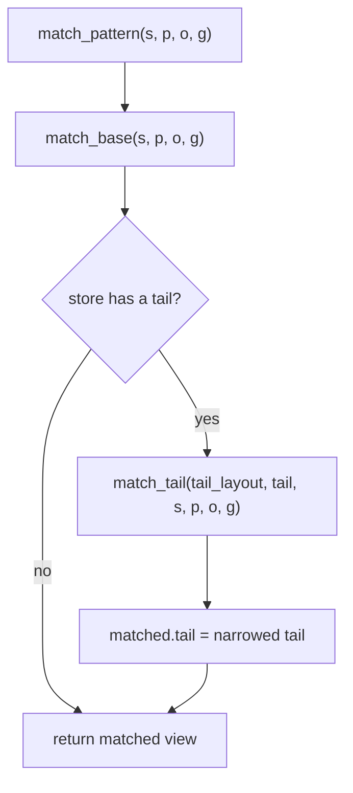
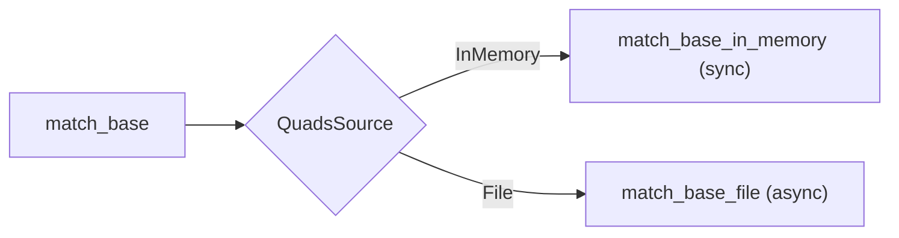
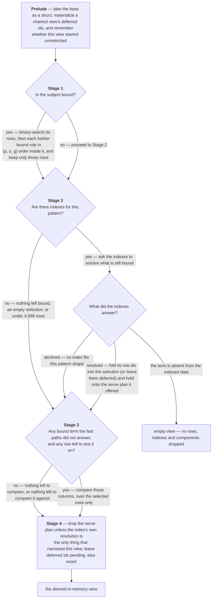
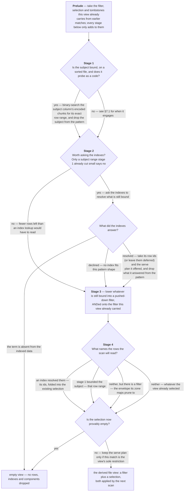
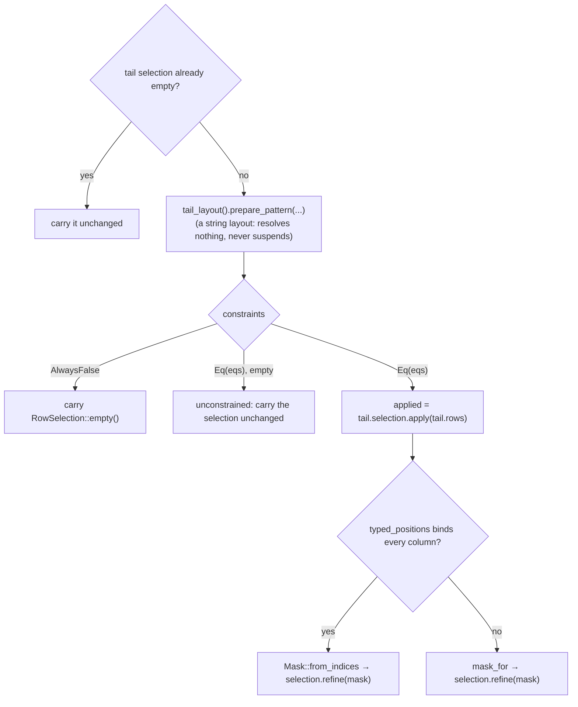

# How a quad pattern is resolved

This document traces what actually runs when a caller asks
[`VortexRdfStore::match_pattern`](../core/src/store/matching.rs) for the quads
matching a `(subject, predicate, object, graph)` pattern — every stage, every
decision point, and how the answer changes with the pattern shape, the storage
backend (in memory or file), the column layout, the secondary indexes present,
and the state of the append tail (see [file-format.md](./file-format.md) for more details of the data structure). Every stage is illustrated on one small
store ([§1.1](#11-the-running-example)); what the paths cost at scale is in
[§14](#14-what-each-path-costs), and how to watch a match make its decisions
in [§15](#15-watching-a-match-happen).

---

## 1. What a match produces

`match_pattern` **reads no rows**. It returns another `VortexRdfStore` — a
*derived view* over the same base data, carrying the restrictions the pattern
implies:

| Backend | Restrictions a match can compose |
|---|---|
| In memory | a `RowSelection` over base row ids (`All` / `Range` / `Ids`), plus an optional serve plan |
| File | a pushed-down filter `Expression`, a `RowSelection` over file row ids, plus an optional serve plan |

Everything a view names is a **base row id** (i.e., row positions in the base quad columns). That is
what lets secondary indexes (whose `rid` columns address base rows) survive a
match, and what lets matches be chained.

Three pieces of vocabulary recur below:

- **`RowSelection`** ([`selection.rs`](../core/src/store/selection.rs)) — `All`,
  a contiguous `Range`, or an ascending unique `Ids` list. A range and an id
  list are mutually exclusive by construction.
- **`ViewSelection`** — `Exact(RowSelection)` or `Pending(LazyRowIds)`. Pending
  means an index resolved the match but the exact ids were never computed,
  because a serve plan answers reads without them.
- **Serve plan** ([`indexes/serve.rs`](../core/src/store/indexes/serve.rs)) —
  the matched quads read straight out of the answering index's own columns
  (a contiguous run) instead of gathering the primary columns at scattered row
  ids. Purely an optimization; the row ids alone are always sufficient.

### 1.1 The running example

The examples in this document all match against the four-quad store of
[file-format.md §7](file-format.md#7-a-worked-example):

```turtle
@prefix ex: <http://example.org/> .
@prefix foaf: <http://xmlns.com/foaf/0.1/> .
@prefix rdf: <http://www.w3.org/1999/02/22-rdf-syntax-ns#> .

ex:alice a foaf:Person ;
   foaf:name "Alice" .

ex:bob a foaf:Person ;
   foaf:knows ex:alice .
```

In `(s, p, o, g)` order — the order every builder writes — its base rows are:

| row | s | p | o | g |
|---|---|---|---|---|
| 0 | `ex:alice` | `rdf:type` | `foaf:Person` | `""` |
| 1 | `ex:alice` | `foaf:name` | `"Alice"` | `""` |
| 2 | `ex:bob` | `rdf:type` | `foaf:Person` | `""` |
| 3 | `ex:bob` | `foaf:knows` | `ex:alice` | `""` |

Terms are written in their prefixed form throughout; the string layouts store
and compare the full N-Triples term (`<http://example.org/alice>`), and `""` is
the default graph.

Under the `Dictionary` layout every column holds the term's
position in the sorted dictionary instead, and the examples quote those codes
wherever a probe value is one:

| code | term |
|---|---|
| 0 | `""` |
| 1 | `"Alice"` |
| 2 | `ex:alice` |
| 3 | `ex:bob` |
| 4 | `rdf:type` |
| 5 | `foaf:Person` |
| 6 | `foaf:knows` |
| 7 | `foaf:name` |

Row 0 in the base quads is then encoded as: `2 4 5 0`.

Patterns are written as four slots with `?` for unbound: `(ex:alice ? ? ?)`,
`(? a foaf:Person ?)`, `(ex:bob foaf:knows ex:alice "")`. In the predicate slot
`a` is Turtle's keyword for `rdf:type` (code 4). Row ids are base row ids,
and a range `[lo, hi)` excludes `hi`.

---

## 2. Top level: *base* and *tail* are matched independently



The tail branch runs **even when the base short-circuited to an empty view**.
Under the Dictionary layout the base's _dictionary_ is frozen
at construction, so a term it has never seen cannot gurantee they have been appended
since.

**Example.** After `add_quad(ex:carol a foaf:Person "")` on the Dictionary
store, `(ex:carol ? ? ?)` won't find `ex:carol` — the base returns an empty view (see [stage B](#4-stage-b--the-provable-emptiness-gate))
— and the tail, which holds the new quad, still matches its one
row: the result is that row. [§9](#9-the-tail) walks the tail side.

---

## 3. Stage A — `prepare_pattern`

Every match begins with
[`ResolvedLayout::prepare_pattern`](../core/src/store/layouts/mod.rs), which
returns a `PatternCodes` **witness** — the object every later stage probes for a
term's column value. All three layouts produce one; only `Dictionary` does any
work to build it. This is the single point in a match where a dictionary may
perform I/O, and the only reason the prelude is async at all.

| Layout | Residency | What the prelude does | Probe value |
|---|---|---|---|
| `Default` | — | nothing but tag the resolver (never suspends) | the N-Triples string |
| `TypedObject` | — | nothing but tag the resolver (never suspends) | the N-Triples string; the object decomposes into `o_kind`/`o_value`/`o_datatype`/`o_lang` |
| `Dictionary` | in-memory | seeds the role cache by in-memory binary search | `u32` code |
| `Dictionary` | file-backed | four **concurrent** point-read binary searches of the dictionary child (`futures::join!`), seeding every bound role | `u32` code |

What the witness saves is likewise layout-dependent. Its **role cache holds
codes**, so under `Dictionary` a fully-bound pattern costs one dictionary search
per term however many stages and indexes ask for the same probe. The string
layouts have no code to cache: each probe re-renders the term's N-Triples form,
into a scratch buffer the witness owns so the render does not allocate.

`PatternCodes::constraints(...)` lowers the pattern into per-column equalities —
shared by both the in-memory mask scan and the pushed-down
file filter. **Only bound roles emit an equality**. The right-hand side of
each equality is the layout's probe value: the rendered N-Triples string for the
string layouts, the dictionary code for `Dictionary`.

**Example.** For `(ex:alice ? "Alice" ?)` — subject and object bound, predicate
and graph free — the prelude resolves what is bound and exists, and the equalities come out
as:

| Layout | What the prelude resolves | Emitted equalities |
|---|---|---|
| `Default` | nothing | `s = "<http://example.org/alice>"`, `o = "\"Alice\""` |
| `TypedObject` | nothing | `s = "<http://example.org/alice>"`, `o_kind = 2u8`, `o_value = "Alice"` |
| `Dictionary` | `s → 2`, `o → 1` — two binary searches of the dictionary | `s = 2u32`, `o = 1u32` |

The string layouts compare one column per bound role; `TypedObject` is the
exception, expanding a bound object into the 2–4 sub-column equalities its
decomposition implies — `"Alice"@en` would add `o_lang = "en"`, a typed
literal `o_datatype`. `Dictionary` compares `u32` codes, and short-circuits the
whole pattern to **`Constraints::AlwaysFalse`** the moment any bound term is
absent from the dictionary: for `(ex:carol ? ? ?)` the subject resolves to no
code, and nothing below ever runs.

---

## 4. Stage B — the provable-emptiness gate

```rust
if codes.provably_empty(pattern) {
    return Ok(self.empty_view());
}
```

Only the Dictionary layout can reach this: a term missing from the dictionary
cannot match any base row. `empty_view()` returns a view selecting nothing, with its indexes and components dropped (so a chained match on it runs no pointless lookups).

`provably_empty` reads the prelude-seeded role cache (`roles[r] == Some(None)`)
rather than compiling `Constraints` just to test for `AlwaysFalse`: the string
layouts answer `false` without touching it, and every stage below compiles its
own constraints over whatever the fast paths leave residual.

The string layouts (`Default`, `TypedObject`) never prove emptiness here; an
unknown term simply matches zero rows later on.

**Example.** `(ex:carol ? ? ?)` on the Dictionary store ends here on either
backend: `ex:carol` has no code, and the empty view comes back
without a search, an index lookup or a scan. On a
`Default` store the same pattern is not provably empty: the subject search of
stage 1 finds the empty run `[4, 4)` (`ex:carol` sorts after `ex:bob`), and the
later stages see an empty selection and skip.

---

## 5. Stage C — backend dispatch

Here it is decided **where the base rows live**. `match_base` reads
the store's [`QuadsSource`](../core/src/store/source.rs#L35) and hands the prelude's witness to the matching backend. `InMemory` holds the
base array (and any index components) resident (i.e., loaded into RAM), so its stages narrow a
`RowSelection` directly and run synchronously. `File` leaves the rows on disk,
so its stages can only *define* a filter and a selection for the next scan
([§7](#7-the-file-path)), and the arm is async because its chunk probes and
index locates may fetch segments.



---

## 6. The in-memory path

[`match_base_in_memory`](../core/src/store/matching.rs#L191) runs four stages
over the base `StructArray`. Each one asks the same two questions — *can I answer
part of this pattern cheaply?* and *which rows survive?* — narrowing the shared
`RowSelection` and clearing whatever pattern components it answered, so the next
stage only sees what is left.

Only the *struct* is canonical. Its columns stay in the compressed encodings
every in-memory construction gives them
([`compress_built_parts`](../core/src/store/mod.rs#L155)), and the stages below
search them in place through the cached encoded-search probes. No stage
decompresses a column; a match decodes nothing but the rows a mask scan has to
compare ([§6.3](#63-residual-column-filtering)).



Each stage in the code, and where the details are below:

| Stage | Code | Details |
|---|---|---|
| Prelude | [`matching.rs:213-242`](../core/src/store/matching.rs#L213-L242) | — |
| 1 · prefix probe | [`matching.rs:244-327`](../core/src/store/matching.rs#L244-L327), [`search_sorted_bounds`](../core/src/store/array.rs#L178) | [§6.1](#61-prefix-probe) |
| 2 · secondary-index routing | [`matching.rs:329-399`](../core/src/store/matching.rs#L329-L399), [`resolve_indexes_in_memory`](../core/src/store/indexes/mod.rs#L485) | [§6.2](#62-secondary-index-routing) |
| 3 · residual column filtering | [`matching.rs:401-442`](../core/src/store/matching.rs#L401-L442), [`typed_residual_ids`](../core/src/store/scan/typed_eq.rs#L184), [`mask_for`](../core/src/store/matching.rs#L735) | [§6.3](#63-residual-column-filtering) |
| 4 · finalize | [`matching.rs:444-458`](../core/src/store/matching.rs#L444-L458) | [§6.4](#64-keeping-or-dropping-the-serve-plan) |

### 6.1 Prefix probe

Engages when the subject is bound **and** the base's `s` column carries the
`IsSorted` stamp. The stamp witnesses more than the subject column's order: the
rows are in global `(s, p, o, g)` order — nothing this crate writes lacks it:
every builder sorts, a tombstoned gather preserves the order it inherits, and a
rebuild that merges an append tail re-establishes it
([`order_for_rebuild`](../core/src/store/serialize.rs)). So the stage is skipped
only for rows that arrived without the provenance — a foreign or older writer's
file, whose `quads_sorted: false` keeps
[`with_subject_stamp`](../core/src/store/array.rs#L124) from inventing a stamp
those rows never earned. Compacting such a store restores the fast path.

When it engages, the **subject** resolves to its exact `[lo, hi)` run in
`O(log n)`:

- through the store's **cached encoded-search probe**
  (`probes.by_name(base, "s")`) when the column resolves one and the probe value
  is an integer — the Dictionary layout's code column;
- otherwise through the per-call
  [`search_sorted_bounds`](../core/src/store/array.rs#L178), which also handles the
  string layouts' `VarBinView` subject columns.

Then the **roles behind it narrow the run in sort order** — `p` inside the
subject's run, `o` inside that, `g` inside that — each by a windowed binary
search (`bounds_in`, which consults only the window's order: a sub-run of the
sorted base is sorted by its next key) through the cached probe of that column.
The prefix ends at the first role that is unbound, or that has no code or
cached probe (the string layouts stop after the subject; a chained view whose
selection is an id list rather than a range has no window to search). Every
answered role is cleared from the pattern; whatever is still bound falls to
the stages below. So `S???`, `SP??`, `SPO?` and `SPOG` each become one exact
`Range` with nothing residual, while `S?O?` narrows by the subject and leaves
`o` to stage 3.

Unlike its file counterpart, the in-memory subject fast path works under
**every** layout; the deeper prefix needs the Dictionary layout's code
columns.

**Examples** (Dictionary layout; the subject searches the `s` column, every
further role only the run the previous one left):

| Pattern | Subject search | Roles behind it | Leaves |
|---|---|---|---|
| `(ex:alice ? ? ?)` | `s = 2` → `[0, 2)` | `p` unbound — the prefix ends | `Range [0, 2)`, nothing residual |
| `(ex:alice a ? ?)` | `[0, 2)` | `p = 4` within `[0, 2)` → `[0, 1)` | `Range [0, 1)` |
| `(ex:bob foaf:knows ex:alice "")` | `s = 3` → `[2, 4)` | `p = 6` → `[3, 4)`; `o = 2` → `[3, 4)`; `g = 0` → `[3, 4)` | `Range [3, 4)` — what `contains` runs |
| `(ex:alice foaf:knows ? ?)` | `[0, 2)` | `p = 6` within `[0, 2)` → empty: `foaf:knows` exists, but not under `ex:alice` | an empty range; stages 2 and 3 skip |
| `(ex:alice ? "Alice" ?)` | `[0, 2)` | `p` unbound — `o` is not consulted, the probe cannot skip a role | `Range [0, 2)` with `o` still bound, for [stage 3](#63-residual-column-filtering) |

Under `Default` or `TypedObject`, `(ex:alice a ? ?)` still finds `[0, 2)` —
through `search_sorted_bounds` on the string column — but `p` stays bound and
stage 3 compares it over those two rows.

**Cost.** A prefix-answered match is a fixed handful of binary searches, so it
does not grow with the run it finds: on the 1M store `S` (10 rows) costs
≈ 1.8 µs and `SPOG` ≈ 2.8 µs under `Dictionary`. The string layouts pay the
per-call search instead of a cached probe — `S` ≈ 18–26 µs — and roughly
4–8 µs more per residual role compared over the run.

### 6.2 Secondary-index routing

Both index resolvers **decline any pattern with a bound subject** — the sorted
`s` column is the better access path — so this stage only ever answers
predicate/object shapes.

The gate `worth_indexing = !narrowed_elsewhere || selection.len() >= 4096`
(`INDEX_ROUTING_MIN_ROWS`) exists because an index lookup costs
`O(rows matching that component)` regardless of how few rows the view still
holds. Once the subject search has cut the view to a handful of rows, filtering
those rows column-wise is cheaper. Nothing is lost by skipping: a view narrowed
by something else discards any serving plan anyway.

Note the disjunction: `narrowed_elsewhere` is false on entry and **stage 1 is
the only thing that can set it** by this point, so the row count is consulted
only after a successful subject search. A pattern with no bound subject never
runs stage 1, and so reaches the indexes whatever the view's size — chained or
not.

That leaves one case for the count to guard, and it is the reason the stage
sees such patterns at all: stage 1 clears `pat.subject` when it succeeds, so an
`s`-and-`p`-bound pattern arrives here as a bare predicate the indexes *would*
resolve — at a cost proportional to every row carrying that predicate, to
narrow a view the binary search has already cut to a handful of rows. Below the
threshold, filtering those rows in stage 3 is cheaper. Two further guards sit
beside `worth_indexing`: the selection must still be non-empty, and something
must still be bound (`pat.any_bound()`) — a pattern the prefix probe answered
in full leaves the indexes nothing to resolve, so they are never consulted.

`resolve_indexes_in_memory` tries the store's indexes **in preference order**
(`SecondaryByCopy` before `SecondaryByReference`; the in-memory index set is
sorted by `preference_rank`) and takes the first that does not decline. It
answers with one of three resolutions:

| `IndexResolution` | Meaning | What the stage does |
|---|---|---|
| `Empty` | the probed term is absent from the index's data | returns `empty_view()` immediately |
| `Declined` | no index accelerates this pattern shape | nothing; the residual falls to stage 3 |
| `Resolved` | exact base row ids, plus the components they answer and an optional serve plan | clears those components from the pattern and folds the ids in |

A `Resolved` resolution carries its ids in one of two forms. `Eager(ids)` is
intersected into the selection there and then. `Lazy(lazy)` is left
**uncomputed** — becoming the view's `Pending` selection — but only when that
resolution is this view's sole restriction: the view started as `All`, no
subject search narrowed it, nothing is left bound, and a serve plan came with
it. Reads then go through the plan, so decoding and sorting the run's row ids
can wait for a consumer that actually needs them. In every other case the lazy
ids are materialized and intersected immediately.

**Examples** (what each index holds for the running example is laid out
where the index is described: [§8.2](#82-secondarybycopy--two-sorted-quad-copies)
for the sorted copies, [§8.3](#83-secondarybyreference--sorted-val-rid-pairs)
for the `{val, rid}` pairs).

| Pattern | With `SecondaryByCopy` | With `SecondaryByReference` |
|---|---|---|
| `(? a ? ?)` | `choose` picks the POSG family; `p = 4` bounds `index:posg` to `[0, 2)` (rids `0, 2`) → `Resolved`, `Lazy` rids, plan over that run. The view started `All`, stage 1 never ran, nothing is left bound → the ids stay **pending** and the plan is kept | `ref-p`, `val = 4` → `[0, 2)` → rids `[0, 2]`, sorted → `Eager` → selection `Ids [0, 2]`, no plan |
| `(? a foaf:Person ?)` | the `(p, o)` prefix: `p = 4` → `[0, 2)`, then `o = 5` within it → `[0, 2)`; both components resolved, nothing residual | the object is preferred: `ref-o`, `val = 5` → `[2, 4)` → rids `[0, 2]`; `p` stays bound, and stage 3 tests it on those two rows |
| `(? ? ? "")` | no family sorts by `g` → `Declined`; stage 3 scans `g` | same |
| `(? a ? "")` | `p` resolves as above, but `g` is still bound — the lazy ids materialize now (`[0, 2]`), stage 3 tests `g` on them, and stage 4 drops the plan | `ref-p` → `[0, 2]`, stage 3 tests `g` |
| `(ex:alice ? "Alice" ?)` | stage 1 cut the view to 2 rows, under `INDEX_ROUTING_MIN_ROWS` → routing skipped (`worth_indexing` is false); on the 1M store a subject run is 10 rows, so the same | same |
| `(? ? "Carol" ?)`, `Default` layout | the dictionary cannot prove absence, the index can: the `index:ospg` run for `"Carol"` is empty → `Empty` → empty view | `ref-o` run empty → `Empty` |

**Cost.** In memory on the 1M store, a by-copy resolution is ≈ 2–3 µs
whatever the run's width — the rids are sliced, not decoded (`P`, 31,776
rows: 2.0 µs). A by-reference resolution decodes and sorts its rids on the
spot: `O` (2 rows) 6.3 µs, `P` (31,776 rows) 29 µs. Without an index the same
shapes fall to stage 3 at ≈ 0.85–1.2 ms.

### 6.3 Residual column filtering

Whatever no fast path answered is compiled to constraints ([§3](#3-stage-a--prepare_pattern))
and compared column-wise, over **only the rows the view still selects**. The
compile can in principle answer `AlwaysFalse` — an empty view — but not here:
the residual binds a subset of roles the [stage B gate](#4-stage-b--the-provable-emptiness-gate)
already resolved, so that arm exists for totality. Two implementations, in
order:

1. **Typed residual** ([`scan/typed_eq.rs`](../core/src/store/scan/typed_eq.rs))
   — a direct row loop yielding exact base ids, no slice/compare/mask pipeline.
   It binds each residual equality to a typed column view:
   - canonical non-nullable `u32` primitives → slice loads (and, when every
     constraint is a code compare, a branch-free `(&[u32], u32)` loop);
   - other non-nullable unsigned ints whose encoding resolves an encoded-search
     probe → per-row point reads;
   - canonical non-nullable Utf8 `VarBinView` → length-first view-level compare.

   It **declines** when any column is nullable or unsupported, when a lone
   constraint faces a wide selection (`> 4096` rows — SIMD wins there), or when
   a probe-bound (wire-encoded) column faces a wide selection.

2. **Mask scan** (`mask_for`) — the general vectorized fallback: take the
   gathered rows as a struct (again only the struct, not its columns),
   broadcast each probe to a `ConstantArray`, `Eq`-compare per column, `And`
   them together, then `RowSelection::refine` translates the positional mask
   back into base row ids. Each `Eq` kernel decides for itself how much of its
   column it has to decode, and it sees only the gathered rows.

The whole stage is skipped unless **both** halves of its gate hold: some term
is still bound (stages 1 and 2 clear the components they answer, so a pattern
they fully resolved arrives with nothing to compare) and the selection is still
non-empty (nothing to compare it against). Skipping on the first half is a real
saving, not just a formality: `mask_for` would return `None` without reading a
row, but its arguments — `selection.apply` through the array optimizer, plus a
struct canonicalization — are exactly the per-call cost the gate avoids.

> **Tombstones are deliberately not consulted here.** Every read path applies
> them instead, so a match may name deleted rows without any result showing
> them. Keeping them out also keeps the mask scan's positions aligned with
> `selection.apply`, which is what `refine` maps back through.

**Examples** (no index unless stated):

| Pattern | Residual | Selection on entry | Which implementation | Result |
|---|---|---|---|---|
| `(ex:alice ? "Alice" ?)` | `o = 1` | `Range [0, 2)` from stage 1 | typed: one equality over 2 rows (≤ 4,096) | row 0 has `o = 5`, row 1 has `o = 1` → `Ids [1]` |
| `(? ? ? "")` | `g = 0` | `All` (4 rows) | typed: 4 rows are under the gate | `Ids [0, 1, 2, 3]` |
| `(? a foaf:Person ?)`, `SecondaryByReference` | `p = 4` — the index answered `o` | `Ids [0, 2]` | typed | both hold → `Ids [0, 2]` |
| `(ex:alice a ? ?)`, `Default` layout | `p = "<…#type>"` | `Range [0, 2)` | typed: a `VarBinView` compare, length first | `Ids [0]` |
| `(? p0 ? ?)` on the 1M store | `p = code` | `All` (1,048,576 rows) | **mask scan** — a lone equality over a wide selection declines the typed loop | 31,776 ids |
| `(? p0 o0 ?)` on the 1M store | `p = code`, `o = code` | `All` | typed: two code columns, the branch-free loop | 1 id |
| `(? ? o0 ?)` on the 1M store, `TypedObject` | `o_kind = 2u8`, `o_value = "…"` | `All` | mask scan — the `u8` column binds only through a probe, which declines over a wide selection | 2 ids |

**Cost.** Both implementations read every selected row, so a wide residual is
the one stage whose cost tracks the store, not the result. On the 1M store in
memory: the mask scan of one code column ≈ 0.85–0.97 ms (`P`, `O`, `G`); the
typed loop over two code columns (`PO`) ≈ 1.2 ms; the same scans over the
string layouts' N-Triples columns ≈ 7–9 ms for one column and ≈ 14–16 ms for
two. A narrow residual behind a subject run is a few microseconds — the
`Default` layout's `SP` costs ≈ 8 µs more than its `S`.

### 6.4 Keeping (or dropping) the serve plan

A serving plan describes a contiguous run of the index's own columns. It is only
valid when that run **is** the whole result, so it survives only if:

```
unrefined (the view started as All)  AND  nothing else narrowed the view
```

A deferred (`Pending`) selection is kept under the strictly stronger condition
that additionally requires nothing to be left bound — which is why a pending
selection always rides with a plan.

**Examples** (`SecondaryByCopy`): `(? a ? ?)` keeps its plan — the view
started `All` and only the index narrowed it — and its ids stay pending, so
`size()` answers from the run's width and `quads()` reads `index:posg[0, 2)`
without ever computing `[0, 2]`. `(? a ? "")` loses it: stage 3 ran
for `g`, so `narrowed_elsewhere` is set. `(ex:alice a ? ?)` never had one —
the prefix probe answered, and the indexes were not consulted. A second match
on the `(? a ? ?)` view loses it too, however it resolves: the view no
longer starts `All` ([§11](#11-chained-matches)).

---

## 7. The file path

[`match_base_file`](../core/src/store/matching.rs#L485) composes the same
restrictions as the in-memory path, but **nothing is read**: each stage decides
what the *next* scan will do, and the result is a filter expression plus a row
selection.



Each stage in the code, and where the details are below:

| Stage | Code | Details |
|---|---|---|
| Prelude | [`matching.rs:494-505`](../core/src/store/matching.rs#L494-L505) | — |
| 1 · subject chunk probe | [`matching.rs:506-524`](../core/src/store/matching.rs#L506-L524), [`locate_subject_run`](../core/src/store/scan/file_scan.rs#L342) | [§7.1](#71-subject-chunk-probe) |
| 2 · secondary-index routing | [`matching.rs:525-541`](../core/src/store/matching.rs#L525-L541), [`resolve_indexes_file`](../core/src/store/indexes/mod.rs#L509) | [§8](#8-the-index-resolvers) |
| 3 · pushed-down filter | [`matching.rs:554-638`](../core/src/store/matching.rs#L554-L638), [`build_file_filter`](../core/src/store/scan/file_scan.rs#L327) | [§7.3](#73-what-ends-up-on-the-view) |
| 4 · selection and serve plan | [`matching.rs:547-548`](../core/src/store/matching.rs#L547-L548) and [`matching.rs:639-688`](../core/src/store/matching.rs#L639-L688), [`row_range_from_pruning`](../core/src/store/scan/file_scan.rs#L544) | [§7.2](#72-zone-map-pruning), [§7.3](#73-what-ends-up-on-the-view) |

The two paths differ in what a stage produces, not in what it asks. In memory a
stage narrows a `RowSelection` directly; here stage 3 can only *describe* the
residual as a filter, and stage 4 turns whatever remains into row bounds the
scan can honour without reading data.

### 7.1 Subject chunk probe

The file mirror of the in-memory subject binary search
([`locate_subject_run`](../core/src/store/scan/file_scan.rs#L342)): it
binary-searches the subject column's **encoded chunks** through cached chunk
probes, reading only the chunks the bisection touches. It requires `u64::try_from(&probe)` to succeed, so
it engages **only under the Dictionary layout** — a string-subject file falls
through to zone-map pruning.

It also declines for a missing chunk handle, an unsupported chunk encoding, or a
file whose `quads_sorted` provenance is false — which, as in
[§6.1](#61-prefix-probe), no writer of ours produces. Both index resolvers
decline bound-subject patterns, so this fast path takes an uncontested route.

Unlike its in-memory counterpart it stops at the subject: the residual terms
ride the narrowed range as filter conjuncts rather than being bounded within it.

**Examples** (Dictionary file): `(ex:alice ? ? ?)` bisects the subject column's
chunks for `s = 2` and finds `[0, 2)`; the view carries that range and no
filter. `(ex:alice a ? ?)` finds the same `[0, 2)`, and `p = 4` becomes a
pushed-down filter evaluated over those two rows when they are read — the
in-memory path would have narrowed the range to `[0, 1)` instead.
`(ex:alice foaf:knows ? ?)` likewise carries `[0, 2)` plus `p = 6`, and only
the read discovers that nothing matches.

**Cost.** With the chunk cache warm the probe costs ≈ 5 µs on the 1M file
(`S` 4.8 µs, `SPOG` 8.0 µs against ≈ 2–3 µs in memory); the first probe on a
freshly opened file, which fetches the chunks it bisects, ≈ 0.75 ms.

### 7.2 Zone-map pruning

When no index resolved anything and no subject range was found,
[`row_range_from_pruning`](../core/src/store/scan/file_scan.rs#L544) runs one
`pruning_evaluation` per filter conjunct over the whole file — statistics only,
no row data — and collapses the surviving mask to its enclosing contiguous
range. Interior gaps are kept (the scan's own per-split pruning skips them from
the same cached zone masks); only outer dead space is trimmed. The envelope is
memoized on the shared file handle, keyed by the filter expression.

Results: `Some(0..0)` when nothing can match, `None` when statistics exclude
nothing.

**Example.** `(? a ? ?)` on the Dictionary file without indexes pushes
`p = 4` down. The four-row file is one zone whose `p` statistics span `4..7`,
so nothing is excluded: the result is `None`, the selection stays `All`, and
the filter waits for the read. On the 1M file (128 zones of 8,192 rows) the
predicate `p0` occurs every 33 rows, so every zone keeps it (the log says
`range: false`) and the read evaluates the filter over the whole file — match
≈ 2.6 µs, match plus read ≈ 8 ms, most of it decoding the 31,776 matched rows.
`(? ? o0 ?)` matches two rows whose object the statistics of most zones rule
out, so pruning collapses the scan to the zones that can hold it
(`range: true`) and the read costs ≈ 1.6 ms. Pruning matters most where the
subject cannot be bisected: a `Default` file's `(s0 ? ? ?)` has no chunk
probe (string subject), but subjects are sorted, so every zone's statistics
but one exclude `s0` and the read costs ≈ 0.9 ms rather than a scan of the
file.

### 7.3 What ends up on the view

- **Filter** — the residual pattern, ANDed onto whatever earlier matches left.
  Components an index resolved are *excluded*: the row ids already are exactly
  their matches, so re-filtering would only re-read and re-compare that column.
- **Selection** — the first of these that applies: an index's row ids folded
  into what the view already selected, stage 1's subject range, the envelope
  zone-map pruning collapses the filter to, or the selection the view arrived
  with. An index's ids stay **`Pending`** — never computed — when the serve
  plan below survives, because the plan answers reads without them; in every
  other case they materialize here.
- **Serve plan** — kept only when this match is the view's sole restriction: no
  filter carried in, the incoming selection was `All`, and stage 1 found no
  subject range. The plan reads a contiguous run of the index's own columns,
  which stops being exactly the result the moment anything else narrows the
  view.
- **Tombstones** — a property of the file, not the pattern; they carry across
  unchanged and every read path applies them.

An `Exact` selection that is provably empty normalizes to `empty_view()` before
the view is built. A `Pending` one is left alone: its coverage is unknown by
design, and it may still materialize to nothing later, which every consumer
handles like any other narrow selection.

**Examples** — what the view holds after a match on the Dictionary file with
`SecondaryByCopy`:

| Pattern | Filter | Selection | Serve plan |
|---|---|---|---|
| `(ex:alice ? ? ?)` | none | `Range [0, 2)` from the chunk probe | none (a subject range) |
| `(ex:alice a ? ?)` | `p = 4` | `Range [0, 2)` | none |
| `(? a ? ?)` | none — the index answered `p` | `Ids [0, 2]`, **eager**: the located run is 2 rows, under `POINT_GATHER_MAX_ROWS`. On the 1M file `P`'s run is 31,776 rows and the ids stay `Pending` | over the `index:posg` run |
| `(? a ? "")` | `g = 0` | `Ids [0, 2]` | **kept** — on file the plan carries the `g` equality itself; the in-memory twin drops it |
| `(? ? ? "")` | `g = 0` | `All` — pruning excluded nothing | none |
| `(? ? foaf:Person ?)` then `(? a ? ?)` on that view | `p = 4` ANDed onto nothing | the second match's `Ids [0, 2]` intersected into the first's | dropped: `existing_selection` was no longer `All` |

---

## 8. The index resolvers

Each index owns its own execution and answers in one shared currency:
`IndexResolution` — `Declined`, `Empty`, or `Resolved { row_ids, resolves, serve }`,
where `row_ids` are ascending unique **base** row ids.

### 8.1 Which index handles which shape

`choose()` in each index module, independent of backend:

| Pattern (s, p, o) | `SecondaryByCopy` | `SecondaryByReference` |
|---|---|---|
| subject bound (any shape) | **declines** | **declines** |
| `p` bound, `o` bound | `index:posg`, `(p, o)` prefix probe → resolves **PredicateObject** | `index:ref-o` on the object → resolves **Object** |
| `p` bound only | `index:posg` lead probe → resolves **Predicate** | `index:ref-p` → resolves **Predicate** |
| `o` bound only | `index:ospg` lead probe → resolves **Object** | `index:ref-o` → resolves **Object** |
| neither bound | **declines** | **declines** |

A bound **graph** never routes: neither index sorts by it. It always stays in
the residual (a mask scan in memory, a filter conjunct on file) — except inside
a `FileServePlan`, which carries a graph equality of its own (see 8.4).

### 8.2 `SecondaryByCopy` — two sorted quad copies

Children: `index:posg` (quads sorted by p, o, s, g) and `index:ospg` (sorted by
o, s, p, g), each `{s, p, o, g, rid}`, term strings or `u32` codes.

**In memory:** requires the family's component to exist and be *globally* sorted
(`IndexComponent::find_sorted` — per-chunk sorted data is not binary-searchable).
Binary-searches the lead column for the probe run, then — for a `(p, o)` pattern
— re-searches the second key **within** that run (valid because the family's full
comparator makes the second column sorted inside each lead run). It returns:

- `Empty` if the probe term is absent from the dictionary, or the run is empty;
- `Declined` if the component is missing, unsorted, or probe-incompatible;
- otherwise `Resolved` with **`Lazy` row ids** (the rid slice, decoded and
  re-sorted only on demand) and **always a serve plan** over the matched run.

**On file:** locates the run by binary-searching the child's cached chunk probes
([`locate_component_run`](../core/src/store/indexes/row_ids.rs#L49): lead,
then a windowed second-key search), integers only. Then:

| Located run | Row ids |
|---|---|
| empty | `IndexResolution::Empty` |
| ≤ 256 rows (`POINT_GATHER_MAX_ROWS`) | **Eager**, via [`rid_point_reads`](../core/src/store/indexes/row_ids.rs#L84) |
| wider, or unlocated | **Lazy** — a deferred rid-only pushed-down scan |

The serve plan is built from *every* bound non-subject component (p, o, **g**).
Its `row_range` is kept only when the graph is unbound, since the location
searched sort keys only. If a bound residual term has no dictionary code the
plan cannot be built, and the resolution falls back to an eager filtered scan.

**Example.** `(? a ? ?)`: the lead probe `p = 4` on `index:posg` — rows
`(2 4 5 0 · 0)`, `(3 4 5 0 · 2)`, `(3 6 2 0 · 3)`, `(2 7 1 0 · 1)` in that
order — bounds `[0, 2)`, whose `rid` column reads `0, 2`. In memory that slice
is handed back lazily with a plan over `index:posg[0, 2)`; on file the run is
located through the child's chunk probes and, being 2 rows, its rids are
point-read now (`Eager`) while the plan still serves the quads.
`(? a foaf:Person ?)` adds the windowed second search, `o = 5` inside
`[0, 2)`, and resolves both roles in one probe. `(? ? foaf:Person ?)` goes to
`index:ospg` — rids
`1, 3, 0, 2` — where `o = 5` bounds `[2, 4)`, rids `0, 2`. On the 1M file
`P`'s located run is 31,776 rows: over the point-read cap, so the ids become a
deferred rid-only scan of that run and reads stream the run through the plan
— a scan of exactly that row range, no filter, split by row count so that its
decode runs on many of the runtime's workers rather than inside the single
leaf-chunk split the child's own layout would make of the run.

**Cost.** Locating a run is a few microseconds on either backend (in memory
`P` 2.0 µs, `O` 2.5 µs, `PO` 2.8 µs; on file 3.3–9.5 µs). Reading through the
plan is what differs: in memory the 31,776-row `P` is served in ≈ 8.8 ms
against ≈ 13 ms gathered from a by-reference resolution and ≈ 15 ms after a
scan; on file the served range scan of that run, split across the workers,
reads it in ≈ 2.4 ms against ≈ 4.2–4.6 ms for the filtered scan of the
primaries a by-reference or filter-only match reads through, while narrow
runs (`O`, `PO`) are point-read in ≈ 40 µs.

### 8.3 `SecondaryByReference` — sorted `{val, rid}` pairs

Children: `index:ref-o` and `index:ref-p`. Stores no whole quads, so it **never
supplies a serve plan** and its row ids are **always eager**.

**In memory:** binary-search the sorted `val` column, slice the paired `rid`
run, `sorted_row_ids` puts them back in base row order. Declines when the
component is absent, unsorted, or probe-incompatible.

**On file:** [`locate_component_run`](../core/src/store/indexes/row_ids.rs#L49)
binary-searches the value column's chunk probes
(sorted child + integer probe required). A located run ≤ 256 rows uses
`rid_point_reads`; a wider one uses a rid-only scan restricted to the range —
neither pays filter evaluation. Anything the probes decline falls back to
[`scan_index_row_ids`](../core/src/store/indexes/row_ids.rs#L160), a pushed-down `val == probe` scan that answers whatever the
order.

**Example.** For the running example `index:ref-o` holds
`(1→1) (2→3) (5→0) (5→2)` and `index:ref-p` `(4→0) (4→2) (6→3) (7→1)` —
`{val, rid}` pairs sorted by value. `(? ? foaf:Person ?)`: `val = 5` bounds `[2, 4)`
in `ref-o`, the paired rids are `0, 2`, already in base order. `(? a ? ?)`
bounds `val = 4` in `ref-p` to `[0, 2)`, rids `0, 2`. `(? a foaf:Person ?)` takes
the object's route — the preferred side — and leaves `p` for the residual
stage, which tests it on rows 0 and 2. On the
1M file a `P` run of 31,776 pairs is over the point-read cap: a rid-only scan
of exactly that range answers it (≈ 0.76 ms), where `O`'s two pairs are
point-read (≈ 3 µs).

**Cost.** In memory the rids are decoded and sorted at match time — `O`
6.3 µs, `P` 29 µs — and every read is a gather of the primaries at those ids:
`P` ≈ 13 ms on the 1M store, against ≈ 8.8 ms served from a copy. The trade is
size: `{val, rid}` pairs are a fraction of a second sorted copy of every quad.

### 8.4 Serve plans, side by side

| | `InMemoryServePlan` | `FileServePlan` |
|---|---|---|
| Acquisition | slice the component's `[start, end)` run, or point-read it through cached probes when ≤ 256 rows | a located run: [`component_point_chunk`](../core/src/store/scan/file_scan.rs#L486) point reads when ≤ 256 rows, else a projected scan of exactly its row range, split by row count across the workers ([`located_run_scan`](../core/src/store/indexes/serve.rs#L521)); unlocated: the pushed-down projected+filtered scan of the index child |
| Constraints | implicit in the run's bounds (lead ± second key) | explicit `p`/`o`/`g` term equalities, bound lazily on first read |
| Dropped when | anything else narrowed the view (including a bound graph, which forces a residual scan) | an earlier filter/selection exists, or a subject range applies |
| Tombstones | applied through the plan's `rid` column | applied through the plan's `rid` column |

Both decode through the shared `ServeDecode` tail, relabelling the index's
columns as the primary `(s, p, o, g)` and decoding through the layout the copies
store (`Dictionary` codes, else `Default` strings — even a TypedObject store's
copies decode as `Default`).

---

## 9. The tail

[`match_tail`](../core/src/store/matching.rs) narrows the append tail — small,
unsorted, unindexed — so a scan over its already-few selected rows is the whole
plan.



Notes:

- **`tail_layout()`** is the store's own layout, except under `Dictionary`,
  where it is `Default`: an appended term has no code in the frozen sorted
  dictionary, so the tail keeps N-Triples strings. Patterns therefore probe the
  base **by code** and the tail **by string**, with two separate witnesses.
- Because the tail's layout is always a string layout, the `AlwaysFalse` arm
  cannot fire today; it is the structural counterpart of the base's gate.
- The typed path is what every `contains` — and therefore every `add_quad`
  presence check — rides: raw byte compares over the tail's string columns, no
  per-call compare/canonicalize pipeline.
- `typed_positions` accepts a flat canonical struct **or** a chunked accretion
  of them, which is the shape `add_quads` builds.

**Example.** `add_quad(ex:carol a foaf:Person "")` on the Dictionary store
with `SecondaryByCopy` first runs the presence check — a fully bound match,
which the base proves unmatchable at stage B (`ex:carol` has no code) and the
absent tail cannot answer — then appends the quad to a one-row tail of
N-Triples strings. On the resulting store:

| Pattern | Base | Tail | Rows |
|---|---|---|---|
| `(? a foaf:Person ?)` | `index:posg` prefix probe → pending ids + plan over rows `0, 2` | `p = "<…#type>"`, `o = "<…Person>"` by typed positions over 1 row → position 0 | 3 |
| `(ex:carol ? ? ?)` | provably empty | `s = "<http://example.org/carol>"` → position 0 | 1 |
| `(ex:alice ? ? ?)` | prefix probe → `Range [0, 2)` | typed positions → none | 2 |

The tail's cost is its size: a few rows compared as raw bytes, which is why a
presence check on a small tail is not visible next to the base match.

See [docs/mutations.md](mutations.md) for the tail, tombstone and compaction model.

---

## 10. Pattern-shape cheat sheet

Assuming a store built with sorted subjects and (where stated) secondary
indexes. `→` reads "then".

### 10.1 In memory

| Pattern | Dictionary layout, `SecondaryByCopy` | Dictionary layout, `SecondaryByReference` | No indexes |
|---|---|---|---|
| `????` (nothing bound) | no work: selection stays `All` | same | same |
| `S???` | prefix probe → `Range` | same | same |
| `?P??` | POSG lead probe → lazy ids **+ serve plan** | ref-p probe → eager ids | typed/mask scan of `p` over all rows |
| `??O?` | OSPG lead probe → lazy ids **+ serve plan** | ref-o probe → eager ids | typed/mask scan of `o` |
| `?PO?` | POSG `(p, o)` prefix probe → both resolved, lazy ids **+ serve plan** | ref-o probe (object preferred) → eager ids → residual `p` scan | typed/mask scan of `p ∧ o` |
| `???G` | indexes decline → typed/mask scan of `g` | same | same |
| `?P?G` | POSG lead probe → residual `g` scan **drops the plan**, ids materialize | ref-p probe → residual `g` scan | typed/mask scan |
| `SP??` / `SPO?` / `SPOG` (`contains`) | prefix probe → exact `Range`, nothing residual; indexes never consulted (nothing left bound) | same | same |
| `S?O?` / `S??G` | prefix probe narrows by the subject; residual scan of `o` (or `g`) over the range — index routing skipped entirely if the range is < 4096 rows | same | same |

Under the string layouts (`Default`, `TypedObject`) the prefix probe stops after
the subject (their columns resolve no probe), so `SP??`…`SPOG` become subject
range → residual scan; the probe values change too (strings instead of codes),
and the object of a `TypedObject` store expands into 2–4 residual equalities.

### 10.2 File-backed

| Pattern | Dictionary layout, `SecondaryByCopy` | Dictionary layout, `SecondaryByReference` | No indexes |
|---|---|---|---|
| `????` | selection `All`, no filter | same | same |
| `S???` | subject chunk probe → exact `Range`, no filter | same | same |
| `?P??` | POSG located run → eager ids (≤ 256) or lazy ids **+ serve plan** | ref-p located run → eager ids; filter empty | filter `p = code` → pruning envelope |
| `??O?` | OSPG located run → same as above | ref-o located run → eager ids | filter `o = code` → pruning envelope |
| `?PO?` | POSG `(p, o)` windowed location → both resolved, **serve plan** | ref-o located run → eager ids, filter keeps `p` | filter `p ∧ o` → pruning envelope |
| `?POG` | as above; plan carries `g` too, but its `row_range` is dropped | ref-o ids; filter keeps `p ∧ g` | filter `p ∧ o ∧ g` |
| `SP??` … `SPOG` | subject range; index routing skipped when the range is < 4096 rows; residual becomes the pushed filter | same | subject range (or pruning envelope) + residual filter |

Under the string layouts the subject chunk probe and both indexes' `locate_component_run`
decline (they need integer probes), so a file match reduces to *pushed-down
filter + zone-map pruning* — plus, for `SecondaryByCopy`, a filtered index-child
scan that still supplies a serve plan.

---

## 11. Chained matches

`match_pattern` on an already-derived view composes rather than rebases:

- In memory, a still-`Pending` selection **materializes** at the top of
  `match_base_in_memory` (`selection.materialized()`) — chaining is one of
  the consumers the deferral exists for. `unrefined` is then false, so no serve
  plan can be kept.
- On file, `existing_filter` is ANDed with the new one and `existing_selection`
  is intersected; `keep_serve` is false the moment either is non-trivial.
- The base array / file handle and the index components are **shared**, not
  rebuilt: the selection names base row ids, which no narrowing renumbers. Only
  a physical gather (compaction) invalidates them, and that rebuilds the index
  set over the new order.
- The tail's own selection is tail-local and narrows independently on each call.

**Example.** `(? a ? ?)` on the in-memory `SecondaryByCopy` store gives a
view whose ids are pending with a plan over `index:posg[0, 2)`. Calling
`match_pattern(? ? foaf:Person ?)` on that view: the pending ids materialize first
(`[0, 2]`), so `unrefined` is false; nothing narrowed the view *in this call*,
so the indexes are consulted and `index:ospg` resolves `o = 5` to rids `0, 2`
— lazily, but the deferral condition fails (`unrefined`), so they are
materialized and intersected: `Ids [0, 2]`. Stage 4 drops the plan the second
index offered. Doing the same on the file view ANDs nothing onto the filter
(both matches were answered by an index) and intersects the two id sets. On
the 1M store the pair `(? p0 ? ?)` then `(? ? o0 ?)` costs ≈ 0.65 ms in memory
and ≈ 5.8 ms on file, reading included (`match_chained`, `Default` layout).

---

## 12. What the derived view costs at read time

The match's decisions show up here
([`streaming.rs`](../core/src/store/streaming.rs),
[`rows.rs`](../core/src/store/rows.rs)):

| Consumer | With a serve plan | Without |
|---|---|---|
| `quads()` / `quads_vec()` | decode the plan's run (in memory: slice or point reads; file: point reads ≤ 256 rows, else a range scan of the located run (`located_run_scan`); a projected+filtered scan of the child only when the run was not located) — the pending ids are never touched | gather the selection from the primaries, or run the restricted file scan |
| `shared_quads_vec()` / `shared_quad_chunks()` | as `quads()`, through the plan's shared-term decode twins — one `Arc<str>` per distinct term of a chunk, handed to every row repeating it | the same gather or restricted scan, decoded to shared terms |
| `size()` | in memory a lazy component run knows its width without decoding; on file a located plan's run width answers outright when no filter or tombstones apply, otherwise the ids materialize (then filter masks are counted if a filter is pending) | selection length, or `count_matching_rows` over the filter |
| `code_columns()` / `code_columns_gathered()` | read the four `u32` columns straight off the index's own columns | materialize the selection, then slice/gather the base's buffers — `code_columns_gathered` runs the full read pipeline where the zero-copy path declines (file-backed or non-canonical views) |
| `raw_quad_chunks()` | plan deliberately ignored (it reorders rows; the N-Triples export is order-insignificant) | restricted scan in base row order |

`LazyRowIds` caches into a shared `OnceLock`, so the first consumer that needs
the ids pays for them once and every clone of the view reads them back for free.

**What a read costs**, on the 1M store in memory (Dictionary layout): a point
result — `S`, 10 rows — decodes in ≈ 12 µs on top of its 2 µs match, and a
single row in ≈ 5 µs; `P`'s 31,776 rows take ≈ 8.8 ms served from `index:posg`
(≈ 0.28 µs per row), ≈ 13 ms gathered at by-reference ids and ≈ 15 ms after a
mask scan; `G`'s 61,681 rows ≈ 27 ms (≈ 0.44 µs per row). Decoding rows is
what a wide read pays for; the match in front of it is microseconds with an
index and about a millisecond without. `size()` on a pending in-memory view
costs nothing (the run's width); on a file view it costs nothing for a
located by-copy run and a rid scan of the run otherwise.

---

## 13. Decision points at a glance

| # | Where | Condition | Consequence |
|---|---|---|---|
| 1 | `match_base` | `codes.provably_empty(pattern)` — a bound role resolved to no code | `empty_view()`, no backend work |
| 2 | in memory | `s` bound ∧ `s` stamped sorted ∧ probe casts | binary-search `[lo, hi)`; subject cleared |
| 2b | in memory | selection is a `Range` ∧ next role in (p, o, g) bound ∧ it has a code and a cached probe | `bounds_in` narrows the run; that role cleared; repeat until a role declines |
| 3 | in memory | selection non-empty ∧ something bound ∧ (`!narrowed_elsewhere` ∨ `len ≥ 4096`) | try index routing |
| 4 | in memory | resolution `Lazy` ∧ unrefined ∧ untouched ∧ nothing bound ∧ plan | defer the ids (`Pending`) |
| 5 | in memory | selection non-empty ∧ something still bound | residual filtering |
| 6 | in memory | every residual column typed-bindable ∧ not (single eq over > 4096 rows) ∧ no probe-bound column over a wide selection | typed row loop, else mask scan |
| 7 | in memory | `unrefined ∧ !narrowed_elsewhere` | keep the serve plan |
| 8 | file | `s` bound ∧ `quads_sorted` ∧ integer probe ∧ chunk probes resolve | exact subject row range; subject cleared |
| 9 | file | no subject range ∨ range ≥ 4096 rows | try index routing |
| 10 | file | no existing filter ∧ existing selection `All` ∧ no subject range | `keep_serve` |
| 11 | file | resolution `Lazy` ∧ plan kept | selection stays `Pending` |
| 12 | file | no index resolution ∧ no subject range ∧ filter present | zone-map pruning envelope |
| 13 | file | `Exact` selection empty | `empty_view()` |
| 14 | tail | tail selection empty | carry unchanged |
| 15 | tail | no equalities | every selected tail row matches |
| 16 | tail | `typed_positions` binds every column | typed positions, else mask scan |

### Tuning constants

| Constant | Value | Defined in | Meaning |
|---|---|---|---|
| `INDEX_ROUTING_MIN_ROWS` | 4096 | [`matching.rs`](../core/src/store/matching.rs#L797) | an already-narrowed view below this skips index routing |
| `POINT_GATHER_MAX_ROWS` | 256 | [`selection.rs`](../core/src/store/selection.rs#L338) | runs/selections at or below this are read point-by-point through cached probes (`gather_by_point_reads`, the located-run reads); the file-backed dictionary point-reads a batch of at most this many codes through its chunk leaves and scans a wider one |
| `TYPED_EQ_MAX_ROWS` | 4096 | [`typed_eq.rs`](../core/src/store/scan/typed_eq.rs#L174) | selection size above which the typed row loop declines to the vectorized mask scan: always for a lone residual equality, and for any set that binds a column through an encoded-search probe |

---

## 14. What each path costs

One run of the internals benchmarks —
[`core/benches/match_lazy.rs`](../core/benches/match_lazy.rs) for
`match_pattern` alone ("match"), [`core/benches/benchmark.rs`](../core/benches/benchmark.rs)
for the match plus `quads_vec()` over every matched row ("+ read") — on the
benchmark dataset at 1,048,576 quads: 104,858 subjects, 33 predicates, 524,291
objects, 17 named graphs, 629,199 dictionary terms. Its terms are generated
IRIs, not the running example's — where an example above says `s0`, `p0` or
`o0` it means that dataset's first subject, predicate or object
(`<http://data.example.org/ontology/2026/property/0000>` and the like), which
no prefixed name abbreviates. Warm regime (one store,
caches primed by an untimed first query), fastest of ten samples, one machine,
2026-08-24/25. Read the figures as orders of magnitude and ratios: the dashboard
`scripts/refresh.sh` renders carries the current ones, and
`BENCH_SIZE=1048576 cargo bench --bench match_lazy` reproduces the match
column.

| Probe shape | `S` | `SP` | `SPO` | `SPOG` | `P` | `O` | `PO` | `G` |
|---|---|---|---|---|---|---|---|---|
| rows matched | 10 | 1 | 1 | 1 | 31,776 | 2 | 1 | 61,681 |

### 14.1 In memory

Dictionary layout unless stated.

| Path | Shape | match | + read | What the numbers say |
|---|---|---|---|---|
| stage 1 · prefix probe | `S` / `SP` / `SPO` / `SPOG` | 1.8 / 1.9 / 2.4 / 2.8 µs | 14 / 6.6 / 7.5 / 7.9 µs | nested binary searches through cached probes; independent of the run's width |
| stage 1 · string-layout subject search + residual | `S` / `SP` / `SPOG`, `Default` | 26 / 34 / 47 µs | 35 / 46 / 53 µs | `search_sorted_bounds` per call, then a typed compare over the 10-row run per residual role |
| stage 2 · `SecondaryByCopy` | `P` / `O` / `PO` | 2.0 / 2.5 / 2.8 µs | 8.8 ms / 10 µs / 6.9 µs | rids sliced, never decoded at match time; reads served from the copy |
| stage 2 · `SecondaryByReference` | `P` / `O` / `PO` | 29 / 6.3 / 9.8 µs | 13 ms / 13 µs / 16 µs | rids decoded and sorted now (31,776 for `P`); reads gather the primaries; `PO` adds a 2-row residual for `p` |
| stage 3 · mask scan, one equality | `P` / `O` / `G`, no index | 0.91 / 0.85 / 0.97 ms | 16 ms / 0.92 ms / 27 ms | one vectorized compare over the 1M-row code column, then `refine` |
| stage 3 · mask scan over strings | `P` / `O` / `G`, `Default`, no index | 6.9 / 7.3 / 9.2 ms | 17 / 6.2 / 29 ms | the same scan comparing N-Triples strings |
| stage 3 · typed residual, two equalities | `PO`, no index | 1.2 ms (`Dictionary`) / 16 ms (`Default`) | 1.3 / 14 ms | the branch-free code loop over both columns; the string loop compares views |
| stage 2 declined, stage 3 for `g` | `G`, any index | 1.1 ms | 27 ms | a bound graph never routes |
| first query on a fresh store (cold) | `S` / `P`, `SecondaryByCopy` | 23 / 19 µs | 37 µs / 7.8 ms | the probe caches are built on first use |

### 14.2 File-backed

Dictionary layout unless stated; the file's chunk cache is warm.

| Path | Shape | match | + read | What the numbers say |
|---|---|---|---|---|
| stage 1 · subject chunk probe | `S` / `SP` / `SPOG` | 4.8 / 5.4 / 8.0 µs | 30 / 31 / 37 µs | residual roles ride as filter conjuncts; the read point-reads the run |
| stage 2 · `SecondaryByCopy`, located run | `P` / `O` / `PO` | 3.5 / 3.3 / 9.5 µs | 2.4 ms / 37 µs / 38 µs | `P`'s 31,776-row run defers its ids and is served by a row-count-split scan of the run; `O` and `PO` (≤ 256 rows) point-read rids and quads |
| stage 2 · `SecondaryByReference`, located run | `P` / `O` / `PO` | 0.76 ms / 3.2 µs / 4.2 µs | 8.6 ms / 13 µs / 17 µs | a wide run pays a rid-only scan of the run now; narrow runs point-read |
| stages 3–4 · pushed-down filter + pruning | `P` / `O` / `G`, no index | 2.6 / 2.0 / 2.4 µs | 8.1 ms / 1.6 ms / 13 ms | the match only builds the filter (the envelope is memoized); the read is a filtered scan — pruning keeps only the zones that can hold `o0`, while `p0` occurs in every zone and its read decodes 31,776 rows |
| string-layout file | `S` / `P`, `Default`, no index | 2.6 / 2.6 µs | 0.86 / 11 ms | no chunk probe for a string subject: pruning envelope, then a filtered scan |
| first query on a freshly opened file (cold) | `S` / `P`, no index | 0.75 / 0.48 ms | 2.9 / 8.0 ms | chunk leaves and statistics fetched on first use |

### 14.3 Rules of thumb

- **Answering by search costs microseconds and does not grow with the
  result.** The prefix probe and a by-copy resolution are ≈ 2–3 µs in memory
  and ≈ 3–10 µs on file; `P` resolves 31,776 rows in 2 µs.
- **Answering by scan costs about a millisecond per million rows of codes**,
  7–16 ms per million rows of strings, whatever the result: an indexed and an
  unindexed `P` differ by ≈ 450× at match time in memory.
- **By-reference pays at match time, by-copy at read time — and by-copy reads
  faster in memory.** `P`: 29 µs then 13 ms gathered, against 2 µs then 8.8 ms
  served. On file too, since a located run's scan is split by row count
  across the workers: `P` served in ≈ 2.4 ms against ≈ 4.2–4.6 ms through the
  filtered primary scan a by-reference or filter-only match reads through;
  narrow runs are point-read either way.
- **Wide reads are decode-bound**: ≈ 0.28 µs per row served, ≈ 0.4–0.45 µs
  per row gathered and decoded. A ≤ 256-row point read is ≈ 10–15 µs in
  memory and ≈ 30 µs on file.
- **A file adds fixed costs, not proportional ones**: ≈ 3–5 µs per warm chunk
  probe, ≈ 1–2 ms floor for any filtered scan, and 0.5–3 ms of chunk fetches
  on the first query after opening.

---

## 15. Watching a match happen

Every stage logs the decision it took at `debug` level under the
`vortex_rdf_core` target, stamped with the time since the match began
(the timers only run when debug logging is enabled). The CLI installs
`env_logger`, so on the Dictionary + `SecondaryByCopy` file of the running
example:

```sh
RUST_LOG=vortex_rdf_core=debug vortex-rdf-cli match --input alice.vortex \
  --subject http://example.org/alice \
  --predicate http://www.w3.org/1999/02/22-rdf-syntax-ns#type
```

prints

```
[match_pattern] Prepared pattern codes at 770ns
[match_pattern] File subject bounded by chunk probe at 2.339µs
[match_pattern] File index declined at 4.045µs
[match_pattern] File view built (filter: true, serve: false, pending ids: false) at 8.247µs
```

— the prelude, the subject chunk probe finding `[0, 2)`, index routing not
taken (a subject range under 4,096 rows reports as a decline on the file
path), and a view carrying the range plus `p = 4` as a filter. Any embedder
that installs a `log` logger sees the same lines; what each one means:

| Line | Stage |
|---|---|
| `Prepared pattern codes` | [§3](#3-stage-a--prepare_pattern) — the witness is built, bound terms resolved |
| `Layout proved the pattern unmatchable` | [§4](#4-stage-b--the-provable-emptiness-gate) — a term has no code; the match ends |
| `In-memory subject bounded by binary search` / `File subject bounded by chunk probe` | [§6.1](#61-prefix-probe) / [§7.1](#71-subject-chunk-probe) |
| `In-memory prefix of N more roles bounded by binary search` | [§6.1](#61-prefix-probe) — `p`, `o`, `g` narrowed inside the subject run |
| `… index resolved` (`eager ids` / `served, ids pending` / `ids materialized` on file), `… index declined`, `… index proved empty` | [§6.2](#62-secondary-index-routing) / [§8](#8-the-index-resolvers) |
| `In-memory narrowed by typed residual scan` / `… by mask scan` | [§6.3](#63-residual-column-filtering) — which implementation ran |
| `File narrowed by zone-map pruning (range: …)` | [§7.2](#72-zone-map-pruning) — whether an envelope was found |
| `File selection proved empty` | [§7.3](#73-what-ends-up-on-the-view) |
| `In-memory view built (serve, pending ids)` / `File view built (filter, serve, pending ids)` | [§6.4](#64-keeping-or-dropping-the-serve-plan) / [§7.3](#73-what-ends-up-on-the-view) — what the view carries |
| `Tail matched by typed positions` / `… by mask scan` / `Tail proved the pattern unmatchable` | [§9](#9-the-tail) |

The same store in memory, timings elided:

```
(? a ? ?)                   (ex:alice ? "Alice" ?)            (? a ? "")
Prepared pattern codes      Prepared pattern codes            Prepared pattern codes
In-memory index resolved    In-memory subject bounded by      In-memory index resolved
In-memory view built          binary search                   In-memory narrowed by typed
  (serve: true,             In-memory narrowed by typed         residual scan
   pending ids: true)         residual scan                   In-memory view built
                            In-memory view built                (serve: false,
                              (serve: false,                     pending ids: false)
                               pending ids: false)
```

`(? a ? ?)` is answered by `index:posg` alone and keeps both the plan and
its deferred ids; `(ex:alice ? "Alice" ?)` is a subject run plus a residual
compare; `(? a ? "")` resolves `p` by index but the bound graph sends
it through the residual stage, which costs it the plan. A second match on the
first view — `(? ? foaf:Person ?)` — logs `index resolved` again but builds its view
with `serve: false, pending ids: false`: the view it started from was no longer
unrestricted ([§11](#11-chained-matches)).

---

## 16. Source map

| Concern | File |
|---|---|
| `match_pattern`, `match_base`, both backends, `match_tail`, `mask_for`, `contains` | [`core/src/store/matching.rs`](../core/src/store/matching.rs) |
| Layouts, `QuadPattern`, `PatternCodes`, `Constraints`, `prepare_pattern` | [`core/src/store/layouts/mod.rs`](../core/src/store/layouts/mod.rs) |
| Dictionary residency and the async prelude | [`core/src/store/layouts/dictionary/access.rs`](../core/src/store/layouts/dictionary/access.rs) |
| `RowSelection` / `ViewSelection`, `POINT_GATHER_MAX_ROWS` | [`core/src/store/selection.rs`](../core/src/store/selection.rs) |
| Gathering selected rows, point reads through cached probes | [`core/src/store/scan/gather.rs`](../core/src/store/scan/gather.rs) |
| `IndexResolution`, `ResolvedRowIds`, `LazyRowIds`, planners | [`core/src/store/indexes/mod.rs`](../core/src/store/indexes/mod.rs) |
| Locating index runs on file, rid point reads and scans, `eq_conjunction` | [`core/src/store/indexes/row_ids.rs`](../core/src/store/indexes/row_ids.rs) |
| Sorted quad copies (POSG / OSPG) | [`core/src/store/indexes/secondary_by_copy.rs`](../core/src/store/indexes/secondary_by_copy.rs) |
| Sorted `{val, rid}` pairs | [`core/src/store/indexes/secondary_by_reference.rs`](../core/src/store/indexes/secondary_by_reference.rs) |
| Serve plans and the shared decode tail | [`core/src/store/indexes/serve.rs`](../core/src/store/indexes/serve.rs) |
| Pushed-down filters, split evaluation, pruning, point reads | [`core/src/store/scan/file_scan.rs`](../core/src/store/scan/file_scan.rs) |
| Typed residual/tail equality loops | [`core/src/store/scan/typed_eq.rs`](../core/src/store/scan/typed_eq.rs) |
| View state (`QuadsSource`, `Tail`) | [`core/src/store/source.rs`](../core/src/store/source.rs) |
| Read paths consuming the view | [`core/src/store/streaming.rs`](../core/src/store/streaming.rs), [`core/src/store/rows.rs`](../core/src/store/rows.rs) |
