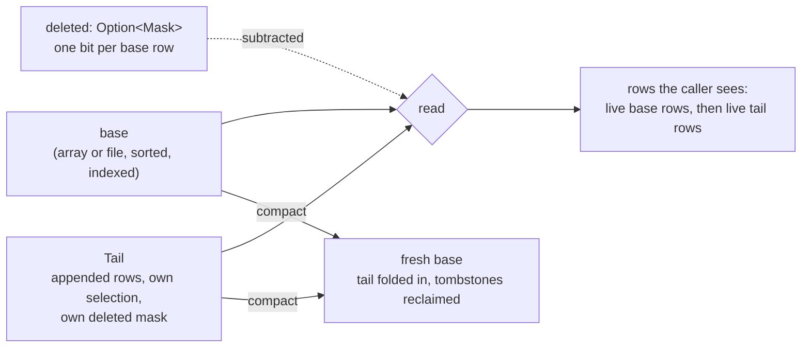
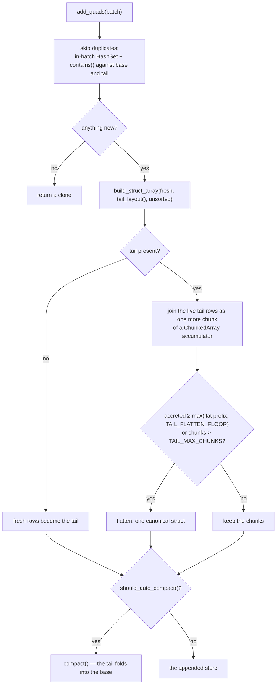
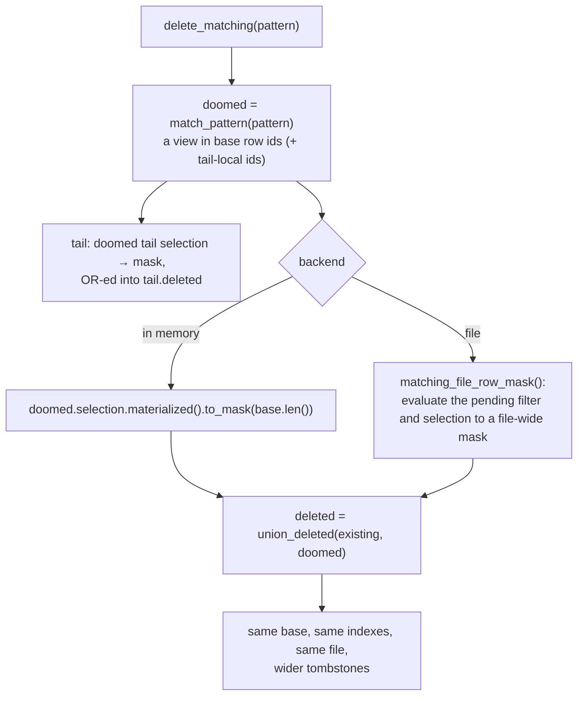
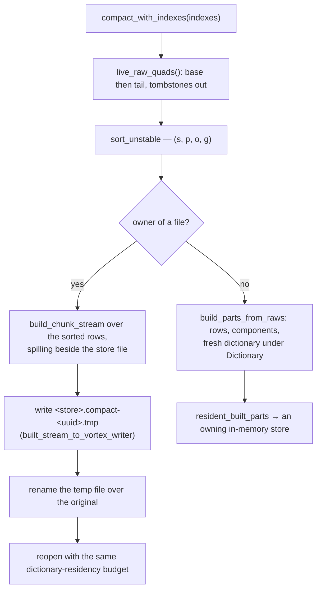

# How a store is mutated

This document describes what happens when a `VortexRdfStore` is changed after
it was built or opened: where appended quads go, how deleted quads are marked,
which reads see which rows, and when — and how — the layers are folded back
into one sorted base. How a store is built is
[serialization.md](serialization.md); what a `.vortex` file looks like is
[file-format.md](file-format.md); how a store is queried, tail included, is
[matching.md](matching.md).

---

## 1. Merge-on-read

A store never rewrites its data in place to answer a mutation; it follows a
[merge-on-read](https://iceberglakehouse.com/iceberg/iceberg-merge-on-read/)
pattern. The store you built or opened — the **base**: its sorted rows, its
secondary indexes, its file bytes — stays exactly as it was written, and
mutations are layered on top of it as two side structures
([`source.rs`](../core/src/store/view/source.rs#L35)):

| Layer | For | Held as |
|---|---|---|
| **Tail** | additions | an in-memory array of appended rows beside the base ([`Tail`](../core/src/store/view/source.rs#L150)) |
| **Tombstones** | deletions | one bit per base row, `None` until the first delete (the `deleted` fields: [in memory](../core/src/store/view/source.rs#L55), [file-backed](../core/src/store/view/source.rs#L94)) |

Every read merges base + tail minus tombstones, so the store behaves as one
dataset. None of the base's row ids ever move, which is what lets the
secondary indexes (whose `rid` columns address base row ids) and every
in-flight view survive a mutation. Nothing reaches the original file unless a
compaction runs ([§5](#5-compaction)).

Mutations return a new store; the receiver is unchanged. Only a store that
owns its rows accepts them ([§6](#6-ownership-and-owned)).

---

## 2. Additions: the append tail

[`add_quad`](../core/src/store/mutation/mod.rs#L33) /
[`add_quads`](../core/src/store/mutation/mod.rs#L50) never touch the base — they
append into the **Tail**, the write-optimized half of the design beside the
read-optimized base.

- **Set semantics.** A quad equal to one already in the store, or to an
  earlier quad of the batch, is skipped: an in-batch `HashSet` catches the
  latter, and each remaining quad is checked with
  [`contains`](../core/src/store/query/matching.rs#L793) — one fully bound
  `match_pattern` over base and tail ([matching.md §9](matching.md#9-the-tail)).
- **Accretion.** Each batch joins the tail as one more chunk of a chunked
  accumulator; the accreted chunks are folded into the flat first chunk
  geometrically — once their rows rival the flat prefix (with a floor so a
  small tail does not flatten on every add), or once enough chunks pile up
  that tail scans, which visit every chunk, would stop being dense
  ([`TAIL_FLATTEN_FLOOR`](../core/src/store/mutation/mod.rs#L279),
  [`TAIL_MAX_CHUNKS`](../core/src/store/mutation/mod.rs#L283)). Amortized, each
  appended row is copied O(1) times.
- **Tail-local ids.** The tail has its own `RowSelection` and its own
  `deleted` mask, in tail-local ids (`0..rows.len()`), separate from the
  base's — a view can narrow or tombstone the tail independently of the base
  it sits beside. Flattening renumbers the old tail's ids, which is safe
  because views of the pre-append store keep the old tail and an owner's
  selections are `All`.
- **Every layout, Dictionary included.** An appended term has no code in the
  base's frozen sorted dictionary, so under the Dictionary layout the tail
  stores Default-layout N-Triples strings ([`tail_layout`](../core/src/store/mod.rs#L384));
  under the other layouts it uses the store's own columns. Patterns probe the
  base by code and the tail by string, and a query that touches both unions
  the results.
- **Matching.** [`match_pattern`](../core/src/store/query/matching.rs#L53) runs the
  base's normal routing (prefix probe / index / scan) and, independently, a
  mask scan over the tail ([`match_tail`](../core/src/store/query/matching.rs#L67)),
  then unions the two. A base short-circuit (a term with no code in the
  dictionary) never skips the tail, since that term may exist in the tail's
  plain strings.
- **Watching it.** [`tail_len`](../core/src/store/mod.rs#L402) is the number
  of physical tail rows — the store's only unindexed, unsorted region, and the
  number to watch when tuning compaction.

---

## 3. Deletions: tombstone masks

[`delete_quad`](../core/src/store/mutation/mod.rs#L122) /
[`delete_matching`](../core/src/store/mutation/mod.rs#L145) never remove or
rewrite rows either — they mark them dead.

- **Which rows.** Both calls reuse `match_pattern` to find the doomed rows
  (`delete_quad` is a fully bound `delete_matching`): the view it returns
  shares this store's base, so the doomed rows are already in base row ids.
  That set is folded into `deleted: Option<Mask>` — one bit per base row —
  carried beside the base, and separately beside the tail. A later delete
  unions into the existing mask
  ([`union_deleted`](../core/src/store/mutation/mod.rs#L287)), so it composes
  with rows already tombstoned; the matcher does not consult the existing
  tombstones, and the union absorbs a doomed set that names already-dead
  rows.
- **Cost.** The base (or the file) and every secondary index built over it
  are left untouched — a tombstone costs a bit per base row, not a copy of
  the surviving data. Tombstoned rows still occupy physical storage until a
  compaction reclaims them.
- **The contract.** `match_pattern` deliberately does **not** subtract
  tombstones when it computes a selection (keeping its row positions aligned
  for mask-based refinement); every *read* path does.
  [`RowSelection::live_mask`](../core/src/store/view/selection.rs#L188) answers
  "which of this selection's own rows are not tombstoned", and the in-memory
  reads all go through [`gather_live`](../core/src/store/scan/gather.rs#L22)
  — the single place a view becomes rows — so applying the mask cannot be
  forgotten by one of them. [`size`](../core/src/store/read/rows.rs#L37) counts
  the live bits without gathering; the tail applies its own mask through
  [`Tail::live_rows`](../core/src/store/view/source.rs#L179).
- **File-backed stores** tombstone the same way (a file cannot be rewritten
  on delete). The doomed set is evaluated to a file-wide mask by
  [`matching_file_row_mask`](../core/src/store/mutation/mod.rs#L259) (through
  [`matching_file_rows`](../core/src/store/scan/file_scan.rs#L300)), and on
  every later read the mask is applied **inside the scan**
  ([`restrict_scan`](../core/src/store/scan/file_scan.rs#L77)) — as an
  `ExcludeByIndex` selection of the deleted ids for an `All` or `Range`
  selection, or subtracted up front from an id list — so it composes with a
  pushed-down filter, whose output carries no row ids to re-align against.

---

## 4. What a read sees

| Read | Base rows | Tail rows |
|---|---|---|
| `size()` | selected rows minus tombstones, counted from the masks | selected tail rows minus the tail's tombstones |
| `quads()` / `quads_vec()` | selected rows gathered, tombstones filtered out, in view order | live tail rows, in append order, after the base |
| `match_pattern` | a narrowed selection over the same base; tombstones untouched | a narrowed tail selection; tombstones untouched |
| `to_bytes()` / `to_serializable_parts()` | a tailed or tombstoned owner re-sorts base + tail into `(s, p, o, g)` order and rebuilds its indexes ([serialization.md §11.1](serialization.md#111-serializing-a-store-to_bytes-to_serializable_parts)) | folded into the same rebuild |
| `compact()` | every live row, base first | every live tail row, then re-sorted with the base |

The rows a rebuild or compaction starts from come from
[`live_raw_quads`](../core/src/store/read/rows.rs#L475): base rows first (in view
order), then tail rows, tombstones already excluded.

---

## 5. Compaction

[`compact`](../core/src/store/mutation/compaction.rs#L29) (keep the current index set)
/ [`compact_with_indexes`](../core/src/store/mutation/compaction.rs#L57) (rebuild a
chosen set) are the only operations that rewrite data. A compaction:

1. Reads every *live* row the view covers — base rows first, then tail rows,
   tombstones excluded (`live_raw_quads`).
2. Sorts them by `(s, p, o, g)`.
3. Rebuilds a fresh base through the normal builder pipeline — under the
   Dictionary layout with a fresh `TermDictionary`, since the tail may hold
   terms the old dictionary never coded — stamping `s` as sorted.
4. Rebuilds the requested secondary indexes over the new order.

The result has an empty tail, no tombstones, and — because it is freshly
sorted — the subject binary-search fast path restored, even if the view being
compacted had lost it (a tail, or a narrowed match result).

- **A file-backed owner stays file-backed**
  ([`stream_compacted_to_file`](../core/src/store/mutation/compaction.rs#L99)): the
  sorted rows are streamed through the out-of-core builder
  ([`build_chunk_stream`](../core/src/store/builders/sorted_stream.rs#L150))
  into a sibling temp file `<store>.compact-<uuid>.tmp`
  ([`create_store_file`](../core/src/io/ser.rs#L171),
  [`built_stream_to_vortex_writer`](../core/src/io/ser.rs#L124)), which is
  then renamed over the original path; the store is reopened with the
  residency budget it was opened with. The sibling placement keeps the rename
  on one filesystem, so it is atomic; a failed write removes the temp file
  and leaves the original untouched. The builder's spill runs are placed in
  the store file's own directory ([`spill.rs`](../core/src/store/builders/spill.rs#L60)),
  the one volume known to fit the data (`VORTEX_RDF_SPILL_DIR` still
  outranks that default).
- **An in-memory store**, and any *derived view* of a file (whose rows are a
  subset of a file other readers share), rebuilds in memory through
  [`from_raw_quads`](../core/src/store/mutation/compaction.rs#L146) →
  [`build_parts_from_raws`](../core/src/store/builders/mod.rs#L272) and adopts
  the result in the same resident form a freshly built store has — canonical
  base, compressed components
  ([serialization.md §10](serialization.md#10-adopting-a-build-in-memory)).

### 5.1 Auto-compaction

`add_quads` is append-then-check: the append itself is policy-free, and
whichever call pushes the tail past a threshold
([`should_auto_compact`](../core/src/store/mutation/compaction.rs#L166) →
[`tail_needs_compaction`](../core/src/store/mutation/compaction.rs#L197)) pays for
folding it back into the base, which amortizes the O(n log n) rebuild to
roughly constant cost per appended row. The tail is folded once it reaches
either of:

| Trigger | Value |
|---|---|
| cap | `AUTO_COMPACT_TAIL_CAP` = one builder chunk, 100,000 rows, whatever the base — the tail is the store's only unindexed, unsorted region (every query mask-scans it, every append rebuilds it), so past this size it would dominate an index-routed lookup on a large base |
| ratio, with a floor | `max(AUTO_COMPACT_TAIL_FLOOR, base / AUTO_COMPACT_BASE_RATIO)` — a tenth of the base, never below 4,096 rows, so a small store is not compacted every few appends |

This applies to in-memory **and file-backed** stores alike: a file-backed
store past the threshold rewrites its source file, as above, as part of the
`add_quads` call.

---

## 6. Ownership and `owned()`

Only a store that owns its rows may be mutated
([`is_owner`](../core/src/store/mod.rs#L435),
[`ensure_owner`](../core/src/store/mod.rs#L447)): its base selection is
`All`, it has no pending file filter, and its tail selection (if any) is
`All`. A view derived from `match_pattern` is a window onto a base it shares,
so mutating it would either silently drop the rows outside the view or write
through to data it does not own; a view that happens to select everything (an
unconstrained match) counts as an owner.

[`owned`](../core/src/store/mod.rs#L418) turns any store into one that can be
mutated: an owner comes back as a cheap clone (tombstones and indexes kept), a
narrowed view is compacted with its declared indexes into an independent
store. Mutating a match result therefore goes `view.owned().await?` first, or
runs the mutation on the store the view came from.

---

## 7. Tuning constants

| Constant | Value | Defined in | Meaning |
|---|---|---|---|
| `TAIL_FLATTEN_FLOOR` | 1,024 | [`mutation.rs`](../core/src/store/mutation/mod.rs#L277) | accreted tail chunks are folded into the flat prefix once their rows reach `max(flat_len, TAIL_FLATTEN_FLOOR)` |
| `TAIL_MAX_CHUNKS` | 64 | [`mutation.rs`](../core/src/store/mutation/mod.rs#L281) | the tail is flattened once it holds more chunks than this, whatever their row counts |
| `AUTO_COMPACT_TAIL_FLOOR` | 4,096 | [`compaction.rs`](../core/src/store/mutation/compaction.rs#L179) | below this many tail rows `add_quads` never compacts |
| `AUTO_COMPACT_BASE_RATIO` | 10 | [`compaction.rs`](../core/src/store/mutation/compaction.rs#L186) | compact once the tail reaches base / 10 |
| `AUTO_COMPACT_TAIL_CAP` | 100,000 (= `DEFAULT_CHUNK_ROWS`) | [`compaction.rs`](../core/src/store/mutation/compaction.rs#L193) | compact once the tail could fill a builder chunk, however large the base |

---

## 8. Source map

| Concern | File |
|---|---|
| `add_quad` / `add_quads`, tail accretion and flatten policy, `delete_quad` / `delete_matching`, `union_deleted` | [`core/src/store/mutation/mod.rs`](../core/src/store/mutation/mod.rs) |
| `compact` / `compact_with_indexes`, file-backed compaction, auto-compaction thresholds | [`core/src/store/mutation/compaction.rs`](../core/src/store/mutation/compaction.rs) |
| `QuadsSource` (base, selection, `deleted`), `Tail` | [`core/src/store/view/source.rs`](../core/src/store/view/source.rs) |
| `RowSelection::live_mask`, `to_mask` | [`core/src/store/view/selection.rs`](../core/src/store/view/selection.rs) |
| `gather_live` — the in-memory read paths' one gather | [`core/src/store/scan/gather.rs`](../core/src/store/scan/gather.rs) |
| `restrict_scan`, `matching_file_rows` — tombstones inside a file scan | [`core/src/store/scan/file_scan.rs`](../core/src/store/scan/file_scan.rs) |
| `size`, `live_raw_quads` | [`core/src/store/read/rows.rs`](../core/src/store/read/rows.rs) |
| `match_pattern`, `match_tail`, `contains` | [`core/src/store/query/matching.rs`](../core/src/store/query/matching.rs) |
| `tail_layout`, `tail_len`, `owned`, `is_owner`, `ensure_owner` | [`core/src/store/mod.rs`](../core/src/store/mod.rs) |
| Re-sorting a tailed or tombstoned store for serialization | [`core/src/store/persist/serialize.rs`](../core/src/store/persist/serialize.rs) |
| The rebuild pipeline compaction reuses | [`core/src/store/builders/mod.rs`](../core/src/store/builders/mod.rs), [`sorted_stream.rs`](../core/src/store/builders/sorted_stream.rs), [`core/src/io/ser.rs`](../core/src/io/ser.rs) |
