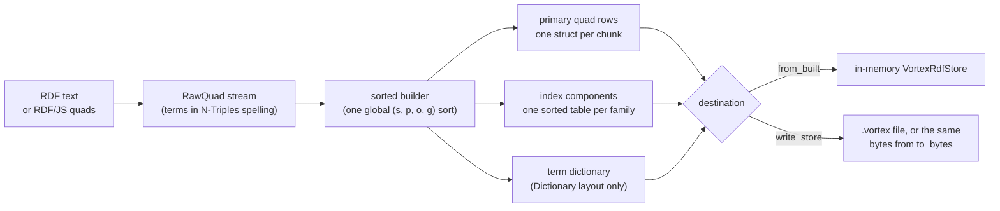
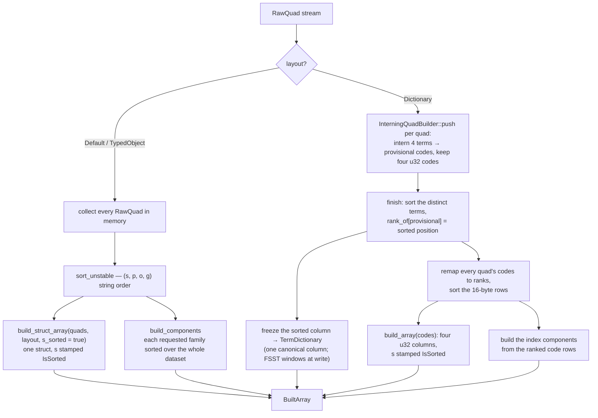
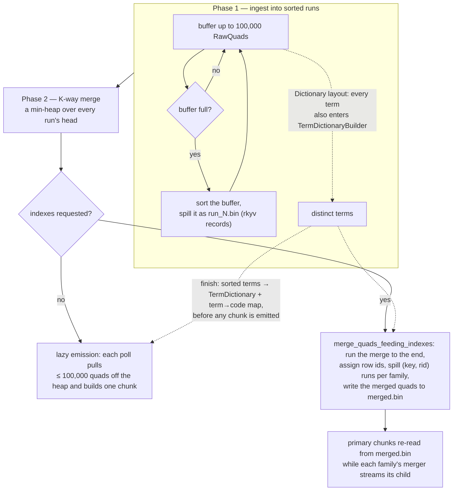
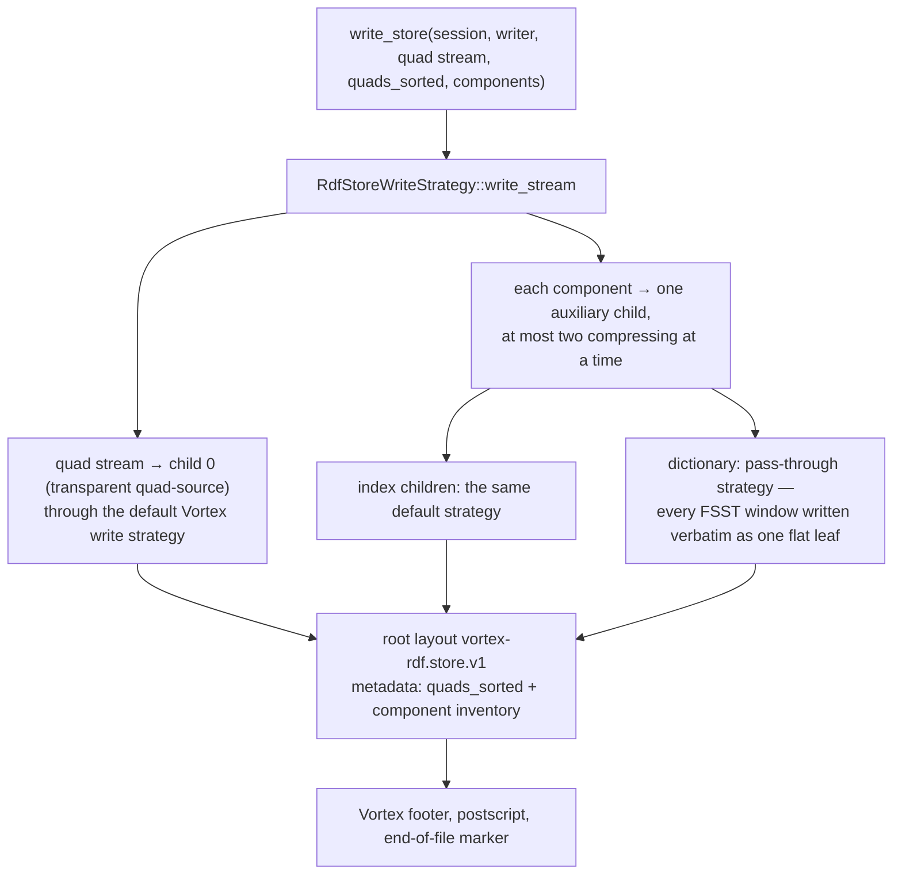

# How a store is built and written

This document traces what runs when RDF quads become a `VortexRdfStore` or a
`.vortex` file: the ingest currency, the two sorting pipelines, how each column
layout and secondary index takes shape, and how the parts are assembled into the
native container. What the resulting file looks like on disk is the subject of
[file-format.md](file-format.md); how a store is queried is
[matching.md](matching.md).

---

## 1. What a build produces

Every build path — whichever binding it starts from and whichever pipeline it
runs — ends in the same three parts, and every destination consumes exactly
those parts:

| Part | In memory | In a file |
|---|---|---|
| Primary quad rows | one `StructArray` in the store's resident form ([§10](#10-adopting-a-build-in-memory)) | the transparent `quad-source` child of the store root |
| Index components | `IndexComponent`s held beside the base | one auxiliary child per family (`index:posg`, `index:ref-o`, …) |
| Term dictionary | a `TermDictionary` inside the resolved layout | the required `dictionary` child |

A builder hands these back in one of two shapes
([`builders/mod.rs`](../core/src/store/builders/mod.rs#L77)):

- **`BuiltArray`** — everything materialized: the quad array, the components,
  the dictionary. What `VortexRdfStore::from_built` adopts.
- **`BuiltStream`** — the schema dtype, a *lazy* stream of primary chunks, the
  components as writable sources, the dictionary, and the `quads_sorted`
  provenance the writer records. What the container writer drives.

---

## 2. Entry points

| Surface | Call | Pipeline | Produces |
|---|---|---|---|
| CLI | `vortex-rdf-cli serialize -i in.ttl -o out.vortex [--layout <default\|typed-object\|dictionary>] [--indexes secondary-by-copy] [--indexes secondary-by-reference] [-f <format>]` (`--layout` defaults to `dictionary`; [`main.rs`](../cli/src/main.rs#L36)) | out-of-core | file |
| Rust | [`io::quads_stream_to_vortex_file`](../core/src/io/ser.rs#L155) / [`quads_stream_to_vortex_writer`](../core/src/io/ser.rs#L95) | out-of-core | file / any `VortexWrite` |
| Rust | [`VortexRdfStore::from_quads`](../core/src/store/mod.rs#L185), or [`SortedStreamBuilder::build_vortex_array`](../core/src/store/builders/sorted_stream.rs#L50) / [`SortedInMemoryBuilder::build_vortex_array`](../core/src/store/builders/sorted_in_memory.rs#L36) then [`VortexRdfStore::from_built`](../core/src/store/mod.rs#L247) to name the builder | either | in-memory store |
| Rust | [`VortexRdfStore::to_bytes`](../core/src/store/persist/serialize.rs#L146) | — (re-serializes a store) | bytes |
| Rust | [`to_serializable_parts`](../core/src/store/persist/serialize.rs#L125) → [`from_parts`](../core/src/store/mod.rs#L224) | — | in-memory round trip |
| Python | `serialize_rdf(input_path, output_path, *, format=None, layout="dictionary", indexes=[])` ([`serialize.rs`](../python/src/serialize.rs#L33)) | out-of-core | file |
| Python | `VortexRdfStore(path, in_memory=True)` | — (opens, then lifts through `to_serializable_parts` → `from_parts`) | in-memory store |
| Python | `store.to_bytes()` / `VortexRdfStore.from_bytes(data)` | — | bytes |
| JavaScript | `VortexRdfStore.fromQuads(quads \| Stream<Quad>, {layout, indexes})`, `fromString(text, format, options)` ([`store.rs`](../js/src/store.rs#L134)), `serializeRdf(text, format, options)` ([`lib.rs`](../js/src/lib.rs#L31)) | in memory (the only pipeline compiled to wasm) | in-memory store / bytes |
| JavaScript | `store.toBytes()` / `VortexRdfStore.fromBytes(bytes)`; `deserializeRdf(bytes, format)` ([`lib.rs`](../js/src/lib.rs#L45)) writes RDF text back | — | bytes |

Every surface defaults to the `dictionary` layout (the CLI's `--layout`,
Python's `layout=`, and the JavaScript `BuildOptions`
([`options.rs`](../js/src/options.rs#L37))) and spells layouts and indexes with
the same kebab-case names, which `LayoutStrategy`/`IndexType` parse and print.

---

## 3. The ingest currency: `RawQuad`

Every builder consumes one thing: a stream of
[`RawQuad`](../core/src/common/quad.rs#L56)s, four owned strings in the exact
form the columns store.

| Field | Spelling | Example |
|---|---|---|
| `s` | `<iri>` or `_:id` | `<http://example.org/alice>` |
| `p` | `<iri>` | `<http://xmlns.com/foaf/0.1/name>` |
| `o` | `<iri>`, `_:id`, `"lit"`, `"lit"@lang`, `"lit"^^<dt>` | `"Alice"` |
| `g` | `<iri>`, `_:id`, or **`""` for the default graph** | `""` |

`RawQuad`'s ordering is lexicographic over the four strings, `s` first — this
is the `(s, p, o, g)` order every build sorts by. IRIs are spelled directly;
literals go through `oxrdf`'s `Display`, which escapes them.

Where the stream comes from:

- **RDF text** — [`parse_quads_from_reader`](../core/src/common/terms.rs#L364)
  drives an `oxrdfio` parser and converts each parsed quad on the spot, so no
  second copy of the terms outlives the conversion. Formats: N-Triples,
  N-Quads, Turtle, TriG, N3, RDF/XML, JSON-LD — named through
  [`format_from_name`](../core/src/common/formats.rs#L20) (`"nt"`, `"ttl"`,
  `"xml"`, …) or detected from the file extension.
- **RDF/JS quads** ([`ingest.rs`](../js/src/ingest.rs)) — an array is packed
  host-side into one length-prefixed buffer per 65,536 quads and decoded inside
  wasm; an RDF/JS `Stream<Quad>` is drained through its `data`/`end`/`error`
  events into a channel. Under the Dictionary layout an array goes straight
  into the interning sink ([§5](#5-pipeline-a--sorted-in-memory)), so no
  per-quad strings accumulate.

---

## 4. Sorting is not a knob

Both pipelines put the rows in global `(s, p, o, g)` order. Which pipeline runs
is a property of the target
([`builders/mod.rs`](../core/src/store/builders/mod.rs#L11)):

| Target | Builder | Holds |
|---|---|---|
| Anywhere with a filesystem (Rust, CLI, Python) | `SortedStreamBuilder` — external merge sort | one chunk of quads, plus spill runs on disk |
| `wasm32-unknown-unknown` (JavaScript) | `SortedInMemoryBuilder` — one in-memory sort; the only builder compiled there | the whole dataset |

The order is what the read side is written against: the `s` column carries the
`IsSorted` stamp, which the store trusts as the witness of the whole
`(s, p, o, g)` order ([matching.md §6.1](matching.md#61-prefix-probe)); the
index children are globally sorted, which is what makes them binary-searchable;
and the file's root metadata records `quads_sorted` so a reader can restore the
stamp on rows it materializes.

---

## 5. Pipeline A — sorted in memory

[`SortedInMemoryBuilder`](../core/src/store/builders/sorted_in_memory.rs)
holds everything and sorts once. It has two shapes, because the Dictionary
layout can do better than sorting strings.

**String layouts.** The stream is drained into a `Vec<RawQuad>`, sorted, and
built into one struct of primary columns through
[`build_struct_array`](../core/src/store/builders/mod.rs#L167); the requested
index families are sorted over that same vector ([§8](#8-secondary-indexes-at-build-time)).

**Dictionary layout.** Terms are interned as they arrive
([`InterningQuadBuilder`](../core/src/store/layouts/dictionary/ingest.rs#L162)):
each distinct term is held once (a `Box<str>` keyed map), and each quad is kept
as four provisional `u32` codes. `finish` sorts the distinct terms, freezes them
into the dictionary, replaces every provisional code by its term's sorted rank —
which *is* the dictionary code — and sorts the coded rows. Because codes are
lexicographic ranks, sorting `[u32; 4]` rows is the same order as sorting the
term strings, so the sort moves 16-byte rows instead of four-string structs.
[`DictionaryQuadSink`](../core/src/store/layouts/dictionary/ingest.rs#L120) is
the push-based form of the same ingest, for callers that produce quads one at a
time (the wasm array path).

**Streaming variant.** `build_vortex_stream` still sorts the whole dataset in
memory but emits the primary columns as windows of
[`DEFAULT_CHUNK_ROWS`](../core/src/store/builders/mod.rs#L52) rows (100,000)
only as the writer polls; the components are complete arrays riding beside the
stream as replayable sources.

---

## 6. Pipeline B — sorted out of core

[`SortedStreamBuilder`](../core/src/store/builders/sorted_stream.rs#L47) is an
external merge sort: peak memory is bounded by the chunk size (plus the
distinct terms, under the Dictionary layout), not by the dataset.

**Phase 1 — runs.** Quads are buffered up to `DEFAULT_CHUNK_ROWS`; a buffer
that would overflow is sorted and spilled as one run file. A dataset that fits
in a single buffer never touches the filesystem — the sorted buffer *is* the
run. Under the Dictionary layout every term is also inserted into a
[`TermDictionaryBuilder`](../core/src/store/layouts/dictionary/ingest.rs#L41)
during this same pass, so the global dictionary is complete before any chunk
flows; the whole distinct-term set is the one thing this pipeline holds for the
dataset's lifetime.

**Phase 2 — merge.** A binary heap holds the head of every run; popping it
yields the globally next quad in `(s, p, o, g)` order.

**Phase 3 — emission.** Without indexes the merge is lazy
([`build_chunk_stream`](../core/src/store/builders/sorted_stream.rs#L150)):
every poll of the chunk stream pulls up to a chunk's worth of quads off the
heap and builds one struct
([`build_struct_array`](../core/src/store/builders/mod.rs#L167), or
[`dictionary::build_chunk`](../core/src/store/layouts/dictionary/mod.rs#L144)
encoding each term through the term→code map). With indexes the merge runs to
completion first ([`merge_quads_feeding_indexes`](../core/src/store/builders/sorted_stream.rs#L326)):
row ids are only known as the merge assigns them, and an index child is a
*globally* sorted table over those ids, so it needs a second external sort.
Each merged quad's terms (strings, or codes under Dictionary) are pushed into
one spiller per requested family, each spilling its own sorted runs:

| Family | Spilled entry | Run files |
|---|---|---|
| `index:ref-o` / `index:ref-p` | `(value, rid)` | `idx_o_run_N.bin`, `idx_p_run_N.bin` |
| `index:posg` / `index:ospg` | `(CopyKey[4 terms in the family's key order], rid)` | `idx_posg_run_N.bin`, `idx_ospg_run_N.bin` |

The merged quads go to `merged.bin` (or stay in memory when the merge had a
single input run). Then each family's merger streams its child's chunks in
global order through a pull-based component source, while the primary chunks
are re-read from `merged.bin` a chunk at a time — no index is ever materialized
whole.

**Spill files** are length-prefixed `rkyv` records (a little-endian `u32`
length, then the archived value) in a per-build temp directory named
`tmp_vortex_<prefix>_<uuid>` and removed when the stream is dropped.
The parent directory is resolved in this order
([`spill.rs`](../core/src/store/builders/spill.rs#L60)): the
`VORTEX_RDF_SPILL_DIR` environment variable, a caller-supplied base (compaction
passes the store file's own directory), then the OS temp dir.

| Build | Peak memory |
|---|---|
| no indexes | heap heads + one chunk (+ the distinct terms under Dictionary) |
| with indexes | as above, plus each spiller's buffer of up to 100,000 entries, plus the components' compressed segments the writer holds until the quad table finishes ([`write.rs`](../core/src/io/container/write.rs#L98)) |

---

## 7. Columns, per layout

The layout decides what a `RawQuad` becomes ([`layouts/mod.rs`](../core/src/store/layouts/mod.rs#L53)).
Every layout puts `s` first and stamps it when the rows are sorted.

| Layout | Columns | Term encoding |
|---|---|---|
| `Default` | `s`, `p`, `o`, `g` — non-nullable `Utf8` | the N-Triples strings, verbatim |
| `TypedObject` | `s`, `p`, `o_kind` (`u8`), `o_value` (`Utf8`), `o_datatype` (nullable `Utf8`), `o_lang` (nullable `Utf8`), `g` | as `Default`, with the object decomposed |
| `Dictionary` | `s`, `p`, `o`, `g` — non-nullable `u32` | codes into one sorted dictionary |

**TypedObject decomposition** ([`decompose_object`](../core/src/store/layouts/typed_object.rs#L76)):

| `o_kind` | Object | `o_value` | `o_datatype` | `o_lang` |
|---|---|---|---|---|
| 0 | IRI | the IRI | null | null |
| 1 | blank node | the id | null | null |
| 2 | plain literal (`xsd:string`) | the value | null | null |
| 3 | language-tagged literal | the value | null | the tag |
| 4 | typed literal | the value | the datatype IRI | null |

**The dictionary** ([`term_dict.rs`](../core/src/store/layouts/dictionary/term_dict.rs))
is the sorted set of every distinct term of the dataset — subjects, predicates,
objects and graph names in one namespace, the default graph's `""` included. A
term's code is its position, so code order equals string order and a bound
term resolves to its code by binary search. The frozen column is held as it
is — one canonical chunk every probe and decode reads in place
([`from_sorted_column`](../core/src/store/layouts/dictionary/term_dict.rs#L350)) —
and FSST-compressed at write ([`fsst_windows`](../core/src/store/layouts/dictionary/term_dict.rs#L452)):
one symbol table is trained on the whole column and the terms are compressed in
independent windows of [`DICT_CHUNK_ROWS`](../core/src/store/layouts/dictionary/term_dict.rs#L59)
(65,536) terms, each window a self-contained FSST array. The term count must
fit an `i32`.

Which pipeline built the dictionary decides how its term→code map is held during
encoding: borrowed from the live quads in memory
([`from_quads_with_map`](../core/src/store/layouts/dictionary/term_dict.rs#L542)),
owned when the quads were spilled and cannot be borrowed from
([`TermDictionaryBuilder::finish`](../core/src/store/layouts/dictionary/ingest.rs#L64)).
Either way the map exists only for the build; stores keep the columnar
dictionary alone.

---

## 8. Secondary indexes at build time

Indexes never ride inside the quad rows: a builder emits primary-only rows plus
one *component* per requested family, and that is the only form index data ever
takes — in memory as an [`IndexComponent`](../core/src/store/indexes/components.rs#L166),
in a file as an auxiliary child.

| Index | Children | Columns | Sorted by |
|---|---|---|---|
| `secondary-by-copy` | `index:posg`, `index:ospg` | `s`, `p`, `o`, `g`, `rid` | `(p, o, s, g)` and `(o, s, p, g)` |
| `secondary-by-reference` | `index:ref-o`, `index:ref-p` | `val`, `rid` | `val`, then `rid` |

Term columns use the layout's encoding — strings under `Default` and
`TypedObject` (a `TypedObject` object is recomposed to its full N-Triples term
for the index), `u32` codes under `Dictionary` — and `rid` is always the `u32`
position of the quad in the sorted primary rows.

**In memory** ([`build_components`](../core/src/store/builders/mod.rs#L234)) each
family is a permutation of the complete sorted dataset: sort the row ids by the
family's comparator ([`CopyFamily::cmp_quads`](../core/src/store/indexes/secondary_by_copy.rs#L145),
or the code tuple under Dictionary), then gather the columns through that
permutation — the permutation itself is the `rid` column. The lead sort column
is stamped `IsSorted`.

**Out of core**, the same tables come off the spill-run mergers of
[§6](#6-pipeline-b--sorted-out-of-core), a chunk at a time.

Both hand the child over with `sorted: true` provenance, because both sorted
the whole dataset; a reader binary-searches a child on that flag alone
([matching.md §8](matching.md#8-the-index-resolvers)).

---

## 9. Writing the container

Whatever produced the parts, one function writes them:
[`write_store`](../core/src/io/container/write.rs#L164). It installs the store's
own write strategy, [`RdfStoreWriteStrategy`](../core/src/io/container/write.rs#L65),
on a stock Vortex file write:

- **The quad table** goes through [`default_child_strategy`](../core/src/io/container/sources.rs#L171)
  — Vortex's default `WriteStrategyBuilder` pipeline: split the struct into
  columns, repartition each column into 8,192-row blocks, compute zoned
  statistics per block, dictionary-encode a column where sampling says it pays,
  coalesce chunks toward ~1 MiB segments, compress each chunk with the
  BtrBlocks-style compressor, and write flat leaf layouts.
- **Index children** take exactly the same strategy, so their encoding is what a
  plain table write produces.
- **The dictionary** takes [`dict_child_strategy`](../core/src/io/container/write.rs#L191):
  its chunks are FSST-compressed windows — made here from a canonical
  dictionary ([`child_chunks`](../core/src/store/layouts/dictionary/term_dict.rs#L1191)),
  or passed through as they were adopted — written verbatim as one flat leaf
  each under a chunked node — no sampling, no re-encoding — and the window
  boundaries become the leaves a file-backed dictionary later point-reads.
- **Ordering.** The quad stream owns the first sequence subtree and each
  component an ordered sibling subtree, so the quad table's segments land ahead
  of every component's, in inventory order; the descriptors and `quads_sorted`
  are encoded into the root layout's metadata ([file-format.md §3](file-format.md#3-the-store-root-vortex-rdfstorev1)).
- **Provenance.** `quads_sorted` is read off the primary's own `s` stamp when a
  store re-serializes ([`serialize_parts`](../core/src/io/ser.rs#L43)) and is
  `true` by construction for a builder's stream; each component's `sorted` flag
  travels on its descriptor.

Two drivers feed this: [`built_stream_to_vortex_writer`](../core/src/io/ser.rs#L124)
for a builder's chunk stream (files, compaction; the file itself comes from
[`create_store_file`](../core/src/io/ser.rs#L171)), and
[`serialize_parts`](../core/src/io/ser.rs#L43) for a store's split parts
(`to_bytes`, the bindings' exchange bytes). On the wire the two are the same
container.

---

## 10. Adopting a build in memory

A build that is queried in place, without a file, skips the writer:
[`from_built`](../core/src/store/mod.rs#L247) turns a `BuiltArray` into the
store's resident form
([`resident_built_parts`](../core/src/store/mod.rs#L154)):

- the base's `u32` code columns are held as flat canonical primitives
  ([`with_canonical_int_children`](../core/src/store/array.rs#L289)): the
  builders assemble anything over `DEFAULT_CHUNK_ROWS` rows as a
  `ChunkedArray`, and one contiguous buffer per column is what lets every
  code read — the Arrow `codes` export, `get_quads` — hand out slices of
  the base without a decode; the `IsSorted` stamps carry across;
- every non-nullable `u32` child of each index component is re-encoded from
  the bounds the build already knows — `Constant` for a single-valued
  column, `RunEnd` for a sorted column with few runs, bit-packed at the
  observed width otherwise
  ([`with_compressed_int_children`](../core/src/store/array.rs#L311)):
  components are only ever probed, never read as a payload, so their
  compressed form costs no read path anything;
- the encoded-search probes over every column are resolved up front
  ([`StructProbes::warm`](../core/src/store/view/probes.rs#L43)), so no query pays the
  encoding-tree walk.

What each form holds resident, and every cache a store keeps, is in
[memory.md](memory.md).

The other in-memory constructor, [`from_parts`](../core/src/store/mod.rs#L224),
adopts a store's split parts (the bindings' round trip): it keeps each integer
child's existing encoding wherever a probe binds it and decodes only the ones
that decline. Opening serialized bytes in memory is
[file-format.md §8](file-format.md#8-reading-a-file).

---

## 11. Rebuilds: mutated stores, compaction, export

A store never rewrites its base to answer a mutation: appends accrete in a
`Tail`, deletes set tombstone bits ([`mutation.rs`](../core/src/store/mutation/mod.rs);
the model is [mutations.md](mutations.md)). Serialization and compaction are
where those layers are folded back into the three parts of
[§1](#1-what-a-build-produces).

### 11.1 Serializing a store (`to_bytes`, `to_serializable_parts`)

[`selected_parts`](../core/src/store/persist/serialize.rs#L75) decides what a view's
parts are:

| The view is… | Rows | Components | Dictionary |
|---|---|---|---|
| a pristine owner (no tail, no tombstones) | its base, as held | passed through; a file view lifts its index children | the store's own |
| tailed, or tombstoned with indexes | live base rows + live tail rows, **re-sorted** into `(s, p, o, g)` order | **rebuilt** over the merged rows | **fresh** under Dictionary — the tail may hold terms the old dictionary never coded |
| narrowed (a `match_pattern` result) | its selected rows only | none — its rows are renumbered, and rebuilding indexes for an arbitrary view is compaction's job | the store's own |

The re-sort ([`order_for_rebuild`](../core/src/store/persist/serialize.rs#L43)) sorts
the small tail alone and merges it into the already-sorted base in a linear
pass; only a base that never carried the stamp pays a full sort. The written
artifact therefore always claims `quads_sorted` truthfully.

### 11.2 Compaction

[`compact`](../core/src/store/mutation/compaction.rs#L29) /
[`compact_with_indexes`](../core/src/store/mutation/compaction.rs#L57) gather every live
quad, sort, and rebuild:

- **A file-backed owner stays file-backed** ([`stream_compacted_to_file`](../core/src/store/mutation/compaction.rs#L99)):
  the sorted rows are streamed through `SortedStreamBuilder` — spilling beside
  the store file, not in the OS temp dir — into a sibling temp file
  `<store>.compact-<uuid>.tmp`, which is atomically renamed over the original;
  the store is then reopened with the residency budget it was opened with.
- **An in-memory store** rebuilds through [`from_raw_quads`](../core/src/store/mutation/compaction.rs#L146)
  (a fresh dictionary under Dictionary, components over the whole set) and
  adopts the result exactly as `from_built` does.

`add_quads` compacts automatically when the tail crosses a threshold
([`tail_needs_compaction`](../core/src/store/mutation/compaction.rs#L197)):

| Trigger | Value |
|---|---|
| never below | 4,096 tail rows (`AUTO_COMPACT_TAIL_FLOOR`) |
| ratio | tail ≥ base / 10 (`AUTO_COMPACT_BASE_RATIO`) |
| cap | tail ≥ 100,000 rows, whatever the base (`AUTO_COMPACT_TAIL_CAP` = `DEFAULT_CHUNK_ROWS`) |

Between compactions the tail accretes as chunks and is flattened once the
accreted rows rival the flat prefix (floor 1,024) or 64 chunks pile up
([`TAIL_FLATTEN_FLOOR`](../core/src/store/mutation/mod.rs#L279),
[`TAIL_MAX_CHUNKS`](../core/src/store/mutation/mod.rs#L283)). The tail, tombstone
and compaction model in full is [mutations.md](mutations.md).

### 11.3 Back to RDF text

The reverse direction is [`export_rdf`](../core/src/store/persist/export.rs#L18) (the
CLI's `deserialize`, the bindings' `toRdf`): N-Triples and N-Quads are written
straight from the raw term columns — the strings *are* the serialization — while
every other format decodes to `oxrdf` terms and drives the `oxrdfio` serializer.

---

## 12. Knobs

| Knob | Where | Default | Effect |
|---|---|---|---|
| `--layout` / `layout` | every surface | `dictionary` | column layout ([§7](#7-columns-per-layout)) |
| `--indexes` / `indexes` | every surface | none | which index families to build ([§8](#8-secondary-indexes-at-build-time)) |
| `DEFAULT_CHUNK_ROWS` | [`builders/mod.rs`](../core/src/store/builders/mod.rs#L52) | 100,000 rows | run size, emitted chunk size, spiller capacity, auto-compaction cap |
| `VORTEX_RDF_SPILL_DIR` | environment | unset (caller base, else OS temp) | where spill runs live |
| `DICT_CHUNK_ROWS` | [`term_dict.rs`](../core/src/store/layouts/dictionary/term_dict.rs#L46) | 65,536 terms | FSST window = dictionary child leaf |
| row block / segment target | Vortex default write strategy | 8,192 rows / ~1 MiB | zone-map granularity and segment size of every written child |
| `VORTEX_RDF_DICT_MAX_RESIDENT_BYTES`, `max_resident_bytes` | environment / Python / `from_file_with_dict_residency` | 512 MiB | not a build knob — decides, at open, whether the dictionary child is lifted resident ([file-format.md §5](file-format.md#5-the-dictionary-child)) |

---

## 13. Source map

| Concern | File |
|---|---|
| `RawQuad`, text parsing, format names | [`core/src/common/quad.rs`](../core/src/common/quad.rs), [`terms.rs`](../core/src/common/terms.rs), [`formats.rs`](../core/src/common/formats.rs) |
| Builder contract, `BuiltArray`/`BuiltStream`, `build_struct_array`, `build_components` | [`core/src/store/builders/mod.rs`](../core/src/store/builders/mod.rs) |
| In-memory sort | [`core/src/store/builders/sorted_in_memory.rs`](../core/src/store/builders/sorted_in_memory.rs) |
| External merge sort, index spill mergers | [`core/src/store/builders/sorted_stream.rs`](../core/src/store/builders/sorted_stream.rs), [`spill.rs`](../core/src/store/builders/spill.rs) |
| Layout columns | [`core/src/store/layouts/default.rs`](../core/src/store/layouts/default.rs), [`typed_object.rs`](../core/src/store/layouts/typed_object.rs), [`dictionary/mod.rs`](../core/src/store/layouts/dictionary/mod.rs) |
| Dictionary construction, interning, FSST windows | [`core/src/store/layouts/dictionary/ingest.rs`](../core/src/store/layouts/dictionary/ingest.rs), [`term_dict.rs`](../core/src/store/layouts/dictionary/term_dict.rs) |
| Index children | [`core/src/store/indexes/secondary_by_copy.rs`](../core/src/store/indexes/secondary_by_copy.rs), [`secondary_by_reference.rs`](../core/src/store/indexes/secondary_by_reference.rs), [`components.rs`](../core/src/store/indexes/components.rs) |
| Write driver and entry points | [`core/src/io/ser.rs`](../core/src/io/ser.rs) |
| Container write strategy, component sources, wire metadata | [`core/src/io/container/write.rs`](../core/src/io/container/write.rs), [`sources.rs`](../core/src/io/container/sources.rs), [`wire.rs`](../core/src/io/container/wire.rs) |
| In-memory adoption, compressed-resident form | [`core/src/store/mod.rs`](../core/src/store/mod.rs), [`array.rs`](../core/src/store/array.rs), [`probes.rs`](../core/src/store/view/probes.rs) |
| Serialization of mutated stores, compaction, mutation policy ([mutations.md](mutations.md)) | [`core/src/store/persist/serialize.rs`](../core/src/store/persist/serialize.rs), [`compaction.rs`](../core/src/store/mutation/compaction.rs), [`mutation.rs`](../core/src/store/mutation/mod.rs) |
| Export to RDF text | [`core/src/store/persist/export.rs`](../core/src/store/persist/export.rs) |
| Bindings | [`cli/src/main.rs`](../cli/src/main.rs), [`python/src/serialize.rs`](../python/src/serialize.rs), [`js/src/store.rs`](../js/src/store.rs), [`js/src/ingest.rs`](../js/src/ingest.rs), [`js/src/options.rs`](../js/src/options.rs) |
